\
# Central — Consumer Integration

> "Central takes it all and gives it all. It's up to the pipe to do with it what it will."
> — Matt Johnson, PM

Central is a **faithful firehose**. Adapters preserve every upstream field; nothing
is enriched, formatted, or opinionatedly translated by Central itself. The CloudEvents
envelope adds routing + dedup support; everything else is upstream-shaped. Consumers
decide what to render and how.

This document is the consumer contract. A consumer (MeshAI today, anything else
tomorrow) should be able to read it once and have everything needed to subscribe,
deserialize, dedup, recover from disconnects, and handle adapter-specific fall-off
semantics. **The doc IS the spec.** If a downstream consumer has to grep Central's
source to understand a field, the doc has failed.

Where this doc lists an *upstream lookup endpoint* for an ID-only field, that is a
**consumer-side convenience** — explicitly NOT a recommendation that Central should
enrich. That's a consumer choice, not Central's job.

---

## Table of contents

1. [Quick start](#1-quick-start)
2. [Connection details](#2-connection-details)
3. [Stream layout](#3-stream-layout)
4. [Subject namespace registry](#4-subject-namespace-registry)
5. [Wire format](#5-wire-format)
   - 5a. [CloudEvents envelope](#5a-cloudevents-envelope)
   - 5b. [Inner Event payload](#5b-inner-event-payload)
6. [Per-adapter reference](#6-per-adapter-reference)
7. [Fall-off / removal semantics](#7-fall-off--removal-semantics)
8. [Consumer patterns](#8-consumer-patterns)
9. [Dedup implementation guide](#9-dedup-implementation-guide)
10. [Writing a new consumer — checklist](#10-writing-a-new-consumer--checklist)
11. [Troubleshooting](#11-troubleshooting)

---

## 1. Quick start

Subscribe to everything Central publishes and print one line per event:

```python
import asyncio
import json
import nats

async def main():
    nc = await nats.connect("nats://central.local:4222")
    js = nc.jetstream()
    # Wildcard at the top: every stream's subject filter is `central.<domain>.>`,
    # so `central.>` covers them all.
    sub = await js.subscribe("central.>", durable="my-consumer")
    async for msg in sub.messages:
        envelope = json.loads(msg.data)
        print(msg.subject, envelope["time"], envelope["source"])
        await msg.ack()

asyncio.run(main())
```

The NATS subject is on `msg.subject` (transport-level). Everything else lives inside
the CloudEvents envelope at `json.loads(msg.data)`. See [§5](#5-wire-format) for the
full envelope shape.

---

## 2. Connection details

### Server URL

Central runs JetStream-enabled NATS on the default 4222 port. The connection URL
shape is one of:

- `nats://<host>:4222` — plain TCP, intra-trust-boundary
- `tls://<host>:4222` — TLS-wrapped (Central deployments serving external consumers
  should require this)

There is no fixed public hostname; ask your Central operator for the URL.

### Auth options

Central supports three NATS auth modes; the operator chooses one at deployment time:

- **Token** — set `token="<value>"` on `nats.connect()`
- **NKEY** — set `nkeys_seed_str=<seed>` or `nkeys_seed=<path>`
- **User / password** — set `user="..."` and `password="..."`

Never embed credentials in source — read them from a secret store. Central does
not document specific credentials in this doc because they are operator state, not
contract state.

### JetStream context

```python
nc = await nats.connect(...)  # core NATS client
js = nc.jetstream()           # JetStream extension client
```

All persistent subscriptions go through `js`, not `nc` — Central's events live in
JetStream streams (not core NATS pub/sub).

### Discovering streams

```python
async for stream in js.streams_info():
    print(stream.config.name, stream.config.subjects)
```

The full registry of streams and subjects is documented in [§3](#3-stream-layout)
and [§4](#4-subject-namespace-registry). Discovery is useful for operational
sanity-checking; do not rely on it for routing decisions (subject patterns are
stable; rely on those).

---

## 3. Stream layout

Central operates seven JetStream streams. Six are event-bearing (consumer-relevant);
one (`CENTRAL_META`) carries status-only messages and is explicitly skipped by
Central's archive.

| Stream | Subject filter | Retention (days) | Storage cap | Event-bearing | Dashboard |
|---|---|---|---|---|---|
| `CENTRAL_WX` | `central.wx.>` | 7 | 1 GiB | ✓ | ✓ |
| `CENTRAL_FIRE` | `central.fire.>` | 7 | 1 GiB | ✓ | ✓ |
| `CENTRAL_QUAKE` | `central.quake.>` | 7 | 1 GiB | ✓ | ✓ |
| `CENTRAL_SPACE` | `central.space.>` | 7 | 1 GiB | ✓ | ✓ |
| `CENTRAL_DISASTER` | `central.disaster.>` | 7 | 1 GiB | ✓ | ✓ |
| `CENTRAL_HYDRO` | `central.hydro.>` | 7 | 1 GiB | ✓ | ✓ |
| `CENTRAL_TRAFFIC` | `central.traffic.>` | 7 | 1 GiB | ✓ | ✓ |
| `CENTRAL_TRAFFIC_FLOW` | `central.traffic_flow.>` | 7 | 1 GiB | ✓ | ✓ |
| `CENTRAL_TRAFFIC_CAMERAS` | `central.traffic_cameras.>` | 7 | 1 GiB | ✓ | ✓ |
| `CENTRAL_AVY` | `central.avy.>` | 7 | 1 GiB | ✓ | ✓ |
| `CENTRAL_META` | `central.meta.>` | 1 | 1 GiB | — | ✓ |

Retention and storage caps are migration-seeded defaults visible in `config.streams`;
operators may tune them at runtime, so treat the values above as starting points,
not invariants. Stream names and subject filters are code-level structural state
(`src/central/streams.py`) and **do not** change without a code release.

---

## 4. Subject namespace registry

```mermaid
graph TD
    root["central.&gt;"]
    root --> wx["central.wx.&gt;"]
    root --> fire["central.fire.&gt;"]
    root --> quake["central.quake.&gt;"]
    root --> space["central.space.&gt;"]
    root --> disaster["central.disaster.&gt;"]
    root --> hydro["central.hydro.&gt;"]
    root --> meta["central.meta.&gt; (status-only)"]

    wx -->|nws| wx_alert["wx.alert.us.&lt;state&gt;.&lt;type&gt;.&lt;code&gt;"]
    fire -->|firms| fh["fire.hotspot.&lt;satellite&gt;.&lt;confidence&gt;"]
    fire -->|inciweb| fn["fire.narrative.inciweb.&lt;state&gt;"]
    fire -->|wfigs_incidents| fi["fire.incident.&lt;state&gt;.&lt;county&gt; (+ .removed.&lt;state&gt;)"]
    fire -->|wfigs_perimeters| fp["fire.perimeter.&lt;state&gt;.&lt;county&gt; (+ .removed.&lt;state&gt;)"]
    quake -->|usgs_quake| qe["quake.event.&lt;tier&gt;"]
    space -->|swpc_alerts| sa["space.alert.&lt;product_id&gt;"]
    space -->|swpc_kindex| sk["space.kindex"]
    space -->|swpc_protons| sp["space.proton_flux"]
    disaster -->|eonet| de["disaster.eonet.&lt;category&gt;.global (+ .removed.global)"]
    disaster -->|gdacs| dg["disaster.&lt;eventtype&gt;.&lt;country&gt; (+ .removed.&lt;country&gt;)"]
    hydro -->|nwis| hn["hydro.&lt;parameter_code&gt;.&lt;agency&gt;.&lt;site_no&gt;"]
```



Full concrete subject patterns, one row per pattern, including removal flavors
where applicable:

| Subject pattern | Adapter | Token semantics |
|---|---|---|
| `central.wx.alert.us.<state>.<county\|zone>.<code>` | `nws` | `<state>` 2-letter lowercase, `<county\|zone>` literal, `<code>` UGC-style code |
| `central.wx.alert.us.unknown` | `nws` | Fallback when the alert lacks a primary region |
| `central.fire.hotspot.<satellite>.<confidence>` | `firms` | `<satellite>` is `viirs_snpp` / `viirs_noaa20` / `viirs_noaa21` / `modis_terra` / `modis_aqua`; `<confidence>` is `low`/`nominal`/`high` |
| `central.fire.narrative.inciweb.<state>` | `inciweb` | `<state>` 2-letter lowercase or `unknown` |
| `central.fire.incident.<state>.<county>` | `wfigs_incidents` | `<state>` 2-letter lowercase, `<county>` lowercased with spaces hyphenated |
| `central.fire.incident.removed.<state>` | `wfigs_incidents` | Tombstone subject for fallen-off incidents |
| `central.fire.perimeter.<state>.<county>` | `wfigs_perimeters` | Same shape as incidents |
| `central.fire.perimeter.removed.<state>` | `wfigs_perimeters` | Tombstone subject for fallen-off perimeters |
| `central.quake.event.<tier>` | `usgs_quake` | `<tier>` is `minor` / `light` / `moderate` / `strong` / `major` / `great` (USGS magnitude bands) |
| `central.space.alert.<product_id>` | `swpc_alerts` | `<product_id>` is the NOAA SWPC product code lowercased, e.g. `a20f` |
| `central.space.kindex` | `swpc_kindex` | Single fixed subject |
| `central.space.proton_flux` | `swpc_protons` | Single fixed subject |
| `central.disaster.<eventtype>.<country>` | `gdacs` | `<eventtype>` is GDACS 2-letter code lowercased (`wf`/`fl`/`tc`/`vo`/`dr`/`eq`); `<country>` is country name lowercased + hyphenated, or `unknown` |
| `central.disaster.<eventtype>.removed.<country>` | `gdacs` | Tombstone (subtype before `removed` per §8 canonical pattern) |
| `central.disaster.eonet.<category>.global` | `eonet` | `<category>` is the EONET upstream id lower_snake_case'd (e.g. `wildfires`, `sea_lake_ice`, `severe_storms`); `global` is the literal country-equivalent suffix (no per-country resolution in v1) |
| `central.disaster.eonet.<category>.removed.global` | `eonet` | Tombstone for missing-from-feed events |
| `central.hydro.<parameter_code>.<agency>.<bare_site_no>` | `nwis` | `<parameter_code>` is the 5-digit USGS pcode (`00060` discharge, `00065` gage height, `00010` water temp); `<agency>` is the lowercased agency prefix from `monitoring_location_id` (`usgs`, `mo005`); `<bare_site_no>` is the agency-prefix-stripped site number |

Subscriber wildcard patterns work as expected — e.g. `central.fire.>` for all fire
events, `central.fire.hotspot.>` for satellite hotspots only, `central.fire.>.>` for
two-token depth (NATS `*` matches one token; `>` matches one or more).

---

## 5. Wire format

Central publishes CNCF CloudEvents v1.0 envelopes onto JetStream subjects. A NATS
message body is the JSON-serialized envelope. The inner `data` field carries
Central's `Event` model.

### 5a. CloudEvents envelope

| Field | Spec | Type | Description |
|---|---|---|---|
| `specversion` | CE core | str | Always `"1.0"` |
| `id` | CE core | str | Same as `Event.id`; serves as the dedup id (`Nats-Msg-Id` header on publish) |
| `source` | CE core | str | Central's source URI (e.g. `"central.echo6.co"`); identifies the publishing Central instance |
| `type` | CE core | str | `"central.<category>.v1"` — derived from the inner `Event.category`. Useful for CE-aware routers; consumers should prefer the NATS `msg.subject` for routing |
| `time` | CE core | str | ISO 8601 timestamp of the underlying event (same as `Event.time`) |
| `datacontenttype` | CE core | str | Always `"application/json"` |
| `centralcategory` | CE extension | str | Mirror of `Event.category`. Lowercase-no-underscores per CloudEvents extension rules |
| `centralseverity` | CE extension | int | Mirror of `Event.severity` when non-null; omitted entirely when severity is `None` |
| `centralschemaversion` | CE extension | str | Central's schema version (currently `"1.0"`) — bumped when the inner `Event` shape changes |
| `data` | CE core | object | The inner Central `Event` (see [§5b](#5b-inner-event-payload)) |

### 5b. Inner Event payload

The CloudEvents `data` field is a JSON-serialized `central.models.Event` Pydantic
model. Fields:

| Field | Type | Nullable | Description |
|---|---|---|---|
| `id` | str | no | Stable across re-publish (dedup key — see [§9](#9-dedup-implementation-guide) for adapter-specific composite shapes) |
| `adapter` | str | no | Adapter identity (`"nws"`, `"firms"`, …) |
| `category` | str | no | Hierarchical category (`"wx.alert.severe_thunderstorm_warning"`, `"fire.hotspot.viirs_noaa20.high"`, …) |
| `time` | str (ISO 8601 UTC) | no | Event-time (upstream timestamp), not processing-time |
| `expires` | str (ISO 8601 UTC) | yes | Adapter-specific expiry (NWS alerts set this; most don't) |
| `severity` | int | yes | `0`–`4` or `None`. Adapter-specific mapping (Green=1/Orange=2/Red=3 for GDACS; FIRMS confidence-driven 1/2/3; etc.) |
| `geo` | object | no | See `Geo` model below |
| `data` | object | no | Adapter-specific upstream payload — see each adapter's section in [§6](#6-per-adapter-reference) |

The `geo` sub-object:

| Field | Type | Nullable | Description |
|---|---|---|---|
| `centroid` | `[float, float]` | yes | **`[lon, lat]` GeoJSON order**, NOT `[lat, lon]`. The single most common consumer bug; check your axis order. |
| `bbox` | `[float, float, float, float]` | yes | `[minLon, minLat, maxLon, maxLat]` |
| `regions` | `list[str]` | no (may be empty) | Region codes — adapter-specific (e.g. NWS uses `US-<STATE>-<UGC-code>`; GDACS uses ISO-3 codes; WFIGS uses `US-US-<STATE>-<COUNTY>`) |
| `primary_region` | str | yes | Alphabetically-first region from `regions`, used as the subject's primary regional token |

**`Event.data` shape varies per adapter.** See [§6](#6-per-adapter-reference) for
the per-adapter field surface. Central never normalizes or strips upstream fields —
whatever the upstream returns lives in `Event.data` verbatim.

---

## 6. Per-adapter reference

Twelve adapters, twelve subsections. Same template. The live JSON examples are
verbatim CloudEvents envelopes pulled from CT104 via `psql ... events.payload`.

### firms — NASA FIRMS satellite-detected fire hotspots

Active-fire detections from the VIIRS and MODIS instruments on NASA / NOAA polar
satellites. Each event is a single thermal-anomaly pixel within ~3 hours of overpass
(NRT delivery). Useful for early ignition detection, hotspot maps, and triggering
ground-survey workflows.

- **Stream:** `CENTRAL_FIRE`
- **Subject pattern:** `central.fire.hotspot.<satellite>.<confidence>`
  - `<satellite>` is `viirs_snpp`, `viirs_noaa20`, `viirs_noaa21`, `modis_terra`, or `modis_aqua`
  - `<confidence>` is `low`, `nominal`, or `high` (derived from upstream's `confidence` field)
- **Cadence default:** 300s (5 min)
- **Dedup key shape:** `<satellite>:<acq_date>:<acq_time>:<lat_3dp>:<lon_3dp>`
  - Coordinates rounded to 3 decimals (~100 m) to absorb floating-point jitter between successive NRT batches
  - Same shape is reused as the inner `Event.id`
- **Event.data fields:**

  | key | type | nullable | description |
  |---|---|---|---|
  | `latitude` | float | no | Pixel center, decimal degrees |
  | `longitude` | float | no | Pixel center, decimal degrees |
  | `acq_date` | str (`YYYY-MM-DD`) | no | UTC date of acquisition |
  | `acq_time` | str (`HHMM`) | no | UTC time of acquisition, zero-padded |
  | `satellite` | str | no | Upstream label (`N`, `N20`, `N21`, `Terra`, `Aqua`) |
  | `instrument` | str | no | `VIIRS` or `MODIS` |
  | `confidence` | str | no | Normalized to `low`/`nominal`/`high` |
  | `confidence_raw` | str | no | Original upstream confidence (single letter for VIIRS; numeric for MODIS) |
  | `daynight` | str | no | `D` or `N` |
  | `frp` | float | yes | Fire Radiative Power, MW |
  | `bright_ti4` | float | yes | Brightness temperature, channel 4 (Kelvin) |
  | `bright_ti5` | float | yes | Brightness temperature, channel 5 (Kelvin) |
  | `scan` | float | yes | Along-scan pixel size, km |
  | `track` | float | yes | Along-track pixel size, km |
  | `version` | str | yes | Upstream data version |

- **Decipherable as-is:** yes. `confidence` + `satellite` + `instrument` are
  human-readable labels; FRP and brightness temperatures are numeric but
  self-describing.
- **Upstream lookup endpoints:** none required. The complete pixel context lives
  in `data`. (For users who want the satellite's orbit metadata, the FIRMS public
  archive is at `https://firms.modaps.eosdis.nasa.gov/`.)
- **Removal semantics:** none. FIRMS publishes detections; absence is the signal
  if a fire stops burning. Consumers should not expect explicit "removal" events.
- **Enrichment (`data._enriched.geocoder`):** FIRMS is the enrichment pilot, so
  each event carries a Central-derived geocoder bundle under
  `data._enriched.geocoder`. It is *not* an upstream FIRMS field — Central
  reverse-geocodes the hotspot's `latitude`/`longitude` and attaches the result.
  The bundle always has these nine keys (any unresolved field is `null`, never
  missing):

  | key | meaning |
  |---|---|
  | `name` | place / feature name |
  | `city` | city / town / village |
  | `county` | county (or equivalent) |
  | `state` | state / province |
  | `country` | country |
  | `postal_code` | postal / ZIP code |
  | `timezone` | IANA tz (e.g. `America/Boise`) |
  | `landclass` | land-management class (US PAD-US) |
  | `elevation_m` | ground elevation, metres |

  **Coverage by region (v0.5.0):** US hotspots get the full bundle (with
  sparsity gaps in deep wilderness); non-US hotspots currently get only
  `timezone` and `elevation_m` populated (both planet-scale), the rest `null`,
  pending an upstream planet expansion. Treat `null` as "not resolved," not
  "does not exist."

  **Known wrinkle — `landclass` antimeridian false-positive:** a non-US hotspot
  near 51–53°N can spuriously get a non-`null` `landclass` (it false-matches the
  Aleutian "Rat Islands" US land-management polygon across the dateline). If you
  consume `landclass`, treat a non-`null` value on a clearly non-US point as
  suspect. Fix is tracked upstream.
- **Live example (verbatim from CT104):**

```json
{
    "id": "VIIRS_NOAA20_NRT:2026-05-17:2008:33.593:-105.314",
    "data": {
        "id": "VIIRS_NOAA20_NRT:2026-05-17:2008:33.593:-105.314",
        "geo": {
            "bbox": [
                -105.31443,
                33.5932,
                -105.31443,
                33.5932
            ],
            "regions": [
            ],
            "centroid": [
                -105.31443,
                33.5932
            ],
            "primary_region": null
        },
        "data": {
            "frp": 224.83,
            "scan": 0.39,
            "track": 0.36,
            "version": "2.0NRT",
            "acq_date": "2026-05-17",
            "acq_time": "2008",
            "daynight": "D",
            "latitude": 33.5932,
            "longitude": -105.31443,
            "satellite": "N20",
            "bright_ti4": 367.0,
            "bright_ti5": 331.11,
            "confidence": "high",
            "instrument": "VIIRS",
            "confidence_raw": "h"
        },
        "time": "2026-05-17T20:08:00Z",
        "adapter": "firms",
        "expires": null,
        "category": "fire.hotspot.viirs_noaa20.high",
        "severity": 3
    },
    "time": "2026-05-17T20:08:00+00:00",
    "type": "central.fire.hotspot.viirs_noaa20.high.v1",
    "source": "central.echo6.co",
    "specversion": "1.0",
    "centralcategory": "fire.hotspot.viirs_noaa20.high",
    "centralseverity": 3,
    "datacontenttype": "application/json",
    "centralschemaversion": "1.0"
}
```

### inciweb — NIFC InciWeb wildfire narrative (editorial RSS)

Narrative wildfire updates from `inciweb.wildfire.gov`, the NIFC editorial RSS feed.
Each event is one incident's full narrative — title, description (plain-text and
HTML forms), state, coordinates parsed from the description body. Editorial quality;
lower spatial precision than WFIGS but rich in plain-language context (incident
overview, recent activity, planned operations).

> InciWeb publishes the same narrative in three near-identical forms for downstream
> tooling compatibility:
> - `raw.description` and `description_html` carry the original HTML-entity-laden
>   form (with `&nbsp;`, `<br/>`, etc.)
> - `description` is the same text with HTML entities decoded, tags stripped, and
>   whitespace normalized
>
> Consumers typically pick one (`description` for plain text; `description_html`
> if they want the HTML markup) and ignore the others. Both are preserved verbatim
> because Central never drops upstream fields.

- **Stream:** `CENTRAL_FIRE`
- **Subject pattern:** `central.fire.narrative.inciweb.<state>`
  - `<state>` is the 2-letter US state lowercased (e.g. `co`, `ca`), parsed from `primary_region`
  - `unknown` if the description doesn't yield a parseable state
- **Cadence default:** 600s (10 min)
- **Dedup key shape:** `<guid>` — the InciWeb RSS feed's numeric incident id
- **Event.data fields:**

  | key | type | nullable | description |
  |---|---|---|---|
  | `guid` | str | no | InciWeb incident id (numeric, e.g. `"312546"`) |
  | `title` | str | no | Incident title with optional prefix code (e.g. `COSJF` = Colorado / San Juan Forest) |
  | `url` | str | no | Public InciWeb page for the incident |
  | `description` | str | no | Plain-text narrative, HTML entities decoded |
  | `description_html` | str | no | Original narrative with HTML entities intact |
  | `raw.guid` | str | no | Same as top-level `guid` (legacy compatibility) |
  | `raw.link` | str | no | Same as top-level `url` |
  | `raw.title` | str | no | Same as top-level `title` |
  | `raw.creator` | str | yes | RSS `dc:creator` — InciWeb username of the publisher |
  | `raw.pubDate` | str | yes | RSS `pubDate` (RFC 822 timestamp) |
  | `raw.description` | str | no | Same as top-level `description_html` (RSS raw form) |

- **Decipherable as-is:** yes. `title` + `description` are plain English.
- **Upstream lookup endpoints:** none required. `url` already resolves to the
  full public page.
- **Removal semantics:** none in v1. InciWeb keeps stale incidents in the feed
  indefinitely; consumers may filter on `raw.pubDate` recency.
- **Live example (verbatim from CT104):**

```json
{
    "id": "312546",
    "data": {
        "id": "312546",
        "geo": {
            "bbox": [
                -107.89302283333333,
                37.273410999999996,
                -107.89302283333333,
                37.273410999999996
            ],
            "regions": [
                "US-CO"
            ],
            "centroid": [
                -107.89302283333333,
                37.273410999999996
            ],
            "primary_region": "US-CO"
        },
        "data": {
            "raw": {
                "guid": "312546",
                "link": "http://inciweb.wildfire.gov/incident-information/cosjf-2026-san-juan-national-forest-prescribed-fire-program",
                "title": "COSJF 2026 San Juan National Forest Prescribed Fire Program",
                "creator": "stowen",
                "pubDate": "Wed, 02 Nov 2022 03:33:16 EDT",
                "description": "Last updated: 2026-04-25\n\n\n--- \n\nThe type of incident is Prescribed Fire and involves the following unit(s) San Juan National Forest. \n\n--- \n\nState: Colorado\n\n--- \n\nCoordinates:\n\nLatitude: 37° 16 24.2796  Longitude: 107° 53 34.8822 \n\n--- \n\nNOTE: All fire perimeters and points are approximations. \n\n--- \n\nIncident Overview: The Dolores Ranger District is planning a prescribed fire operation for Wednesday/Thursday 5/20-5/21 for the following area:Salter-Carlyle (1660 acres). This project is located 15 miles east of Cahone, near Salter Y along NFSR 510 in Montezuma and Dolores Counties. See map for more details.&nbsp;San Juan National Forest began broadcast prescribed fire projects in late March, 2026. Project operations take place in spring and fall.&nbsp;The forests in Southwest Colorado are part of a fire-adapted ecosystem, which historically experienced frequent, low intensity fires on a large scale. Prescribed fire replicates that fire regime and increases the area on our landscape that has been burned at low and moderate conditions. These efforts reduce hazardous ground fuels, lessen the risk of unplanned large-scale wildfire, help restore ponderosa pine ecosystems, and improve wildlife habitat. Prescribed fire also reduces the ladder fuels that can carry fire into the canopy, killing mature trees. Prescribed fire smoke may affect your health. For more information, visit&nbsp;Wood smoke and your health.Columbine Ranger District:&nbsp;Beginning in late March, the Columbine Ranger District will begin the following prescribed fire projects as conditions allow.&nbsp;Smoke will be visible from Arboles, Bayfield, Pagosa Springs, as well as the U.S. Highway 160 and 151 corridors near those towns.Sauls Creek: This project area includes multiple potential units totaling approximately 900 acres. This project is located in Sauls Creek near NFSR 608, east of Bayfield and south of Highway 160 in La Plata County. It is part of a larger fuels reduction strategy that has included commercial logging and other fuels reduction work. The Columbine Ranger District completed 255 acres on the Sauls Creek prescribed fire project March 28-29, 2026 and another 314 acres on April 24-25, 2026.&nbsp;Southern HDs Prescribed Fire:&nbsp;This project is approximately 2,000 acres in the Fosset Gulch area (NFSR 613), west of Chimney Rock National Monument in Archuleta County. Units will be burned using ground ignitions and possibly unmanned aircraft systems (drones) as well. In past years the Columbine District burned adjacent units to help reduce wildfire risk to local homes and infrastructure.Pagosa Ranger District:Beginning in early April, the Pagosa Ranger District plans to implement multiple prescribed fire projects in Archuleta County as weather and conditions allow.Brockover-Devil Prescribed Fire: This 2,100-acre project area consists of \"maintenance\" burning, further reducing ground and ladder fuels. This treatment will build on the 2025 fall prescribed fire operations in the area and complement numerous mastication, thinning, and timber harvest treatments. These units are located along NFSR 629 and 923, west of Pagosa Springs and north of Highway 160. The Pagosa Ranger District completed 1,365 acres of this prescribed fire project April 23, 2026.Echo Canyon Prescribed Fire: This 1,139-acre project is located along NFSR 029 southeast of Pagosa Springs and east of Highway 84. In 2018, this project area was the site of commercial thinning, followed by mastication work in 2021 and prescribed fire in 2023. This year, the District hopes to conduct a \"maintenance\" burn to maximize fuel reduction benefits.&nbsp;Eight Mile Mesa Prescribed Fire: This project is located on Eight Mile Mesa (NFSR 651), south of Pagosa Springs and west of Highway 84. 275 acres will be burned to clean up slash and forest litter following a 2022 oak mastication project as well as other hazardous fuels and timber harvest activities.Dolores Ranger District:&nbsp;The Dolores Ranger District plans to begin prescribed fire implementation in early April. During burning operations, smoke may be visible around Mancos, Dolores, Dove Creek, Cortez, and Highway 491 between Dove Creek and Pleasant View. Smoke may settle into low lying valleys and the Dolores River Canyon overnight.Salter-Carlyle Prescribed Fire: This project is located 15 miles east of Cahone, near Salter Y along NFSR 510 in Montezuma and Dolores Counties.&nbsp;Boggy Draw Prescribed Fire: This 4,107-acre project is located 4-8 miles northeast of Dolores in Montezuma County, along NFSR 526 and 527. Smaller units of this overall project will be implemented as weather and conditions allow (see map). The Dolores Ranger District completed 1,586 acres on the Boggy Draw Prescribed Fire on April 219-20. The area closure was lifted on April 24.------------------------------------------------------------------------------------------------------------------------------------------------------2025/26 Winter Pile Burning Accomplishments:Columbine Ranger District:Junction Creek Road, 32 p iles, 15 acres.Ellington Lane, 100 piles, 4 acres.&nbsp;Pagosa Ranger District:Huerto, 183 acres.&nbsp;Mariposa, 439 acres.&nbsp;Lower Turkey, 12 acres.Valle Seco, 26 acres.Buckles Lake Road, 13 acres.Kenny Flat, 128 acres.Dolores Ranger District:Glade, 231 piles, 652 acres.------------------------------------2025 Broadcast Burning Accomplishments:Dolores Ranger District:&nbsp;Boggy Draw, 1,579 acresHaycamp Mesa, 1,657 acres------------------------------------2024/25 Winter Pile Burning AccomplishmentsDolores Ranger District&nbsp;Haycamp Mesa, 250 acres, 800 pilesTaylor Mesa, 390 acres, 134 pilesPagosa Ranger District&nbsp;Brockover-Devil, 490 acres&nbsp;Kenney Flats, 30 acres&nbsp;Quartz Piles, 20 acres&nbsp;Columbine Ranger District:Saul’s Creek, 50 acres, 100 pilesFossett Gulch, 17 acres, 100 pilesBaldy Mountain, 117 acres, 10 piles------------------------------------2024 Broadcast Prescribed Fire Accomplishments:DOLORES RANGER DISTRICT:Boggy Draw: 1,156 acresSalter Y Units 34 and 37: 1,279 acres&nbsp;COLUMBINE RANGER DISTRICT:Vallecito-Piedra: 235 acresSaul's Creek: 1,615 acresSouthern HDs: 1,080 acresPAGOSA RANGER DISTRICT:Fawn Gulch 1,100 acresMill Creek: 400 acres------------------------------------"
            },
            "url": "http://inciweb.wildfire.gov/incident-information/cosjf-2026-san-juan-national-forest-prescribed-fire-program",
            "guid": "312546",
            "title": "COSJF 2026 San Juan National Forest Prescribed Fire Program",
            "description": "Last updated: 2026-04-25 --- The type of incident is Prescribed Fire and involves the following unit(s) San Juan National Forest. --- State: Colorado --- Coordinates: Latitude: 37° 16 24.2796 Longitude: 107° 53 34.8822 --- NOTE: All fire perimeters and points are approximations. --- Incident Overview: The Dolores Ranger District is planning a prescribed fire operation for Wednesday/Thursday 5/20-5/21 for the following area:Salter-Carlyle (1660 acres). This project is located 15 miles east of Cahone, near Salter Y along NFSR 510 in Montezuma and Dolores Counties. See map for more details. San Juan National Forest began broadcast prescribed fire projects in late March, 2026. Project operations take place in spring and fall. The forests in Southwest Colorado are part of a fire-adapted ecosystem, which historically experienced frequent, low intensity fires on a large scale. Prescribed fire replicates that fire regime and increases the area on our landscape that has been burned at low and moderate conditions. These efforts reduce hazardous ground fuels, lessen the risk of unplanned large-scale wildfire, help restore ponderosa pine ecosystems, and improve wildlife habitat. Prescribed fire also reduces the ladder fuels that can carry fire into the canopy, killing mature trees. Prescribed fire smoke may affect your health. For more information, visit Wood smoke and your health.Columbine Ranger District: Beginning in late March, the Columbine Ranger District will begin the following prescribed fire projects as conditions allow. Smoke will be visible from Arboles, Bayfield, Pagosa Springs, as well as the U.S. Highway 160 and 151 corridors near those towns.Sauls Creek: This project area includes multiple potential units totaling approximately 900 acres. This project is located in Sauls Creek near NFSR 608, east of Bayfield and south of Highway 160 in La Plata County. It is part of a larger fuels reduction strategy that has included commercial logging and other fuels reduction work. The Columbine Ranger District completed 255 acres on the Sauls Creek prescribed fire project March 28-29, 2026 and another 314 acres on April 24-25, 2026. Southern HDs Prescribed Fire: This project is approximately 2,000 acres in the Fosset Gulch area (NFSR 613), west of Chimney Rock National Monument in Archuleta County. Units will be burned using ground ignitions and possibly unmanned aircraft systems (drones) as well. In past years the Columbine District burned adjacent units to help reduce wildfire risk to local homes and infrastructure.Pagosa Ranger District:Beginning in early April, the Pagosa Ranger District plans to implement multiple prescribed fire projects in Archuleta County as weather and conditions allow.Brockover-Devil Prescribed Fire: This 2,100-acre project area consists of \"maintenance\" burning, further reducing ground and ladder fuels. This treatment will build on the 2025 fall prescribed fire operations in the area and complement numerous mastication, thinning, and timber harvest treatments. These units are located along NFSR 629 and 923, west of Pagosa Springs and north of Highway 160. The Pagosa Ranger District completed 1,365 acres of this prescribed fire project April 23, 2026.Echo Canyon Prescribed Fire: This 1,139-acre project is located along NFSR 029 southeast of Pagosa Springs and east of Highway 84. In 2018, this project area was the site of commercial thinning, followed by mastication work in 2021 and prescribed fire in 2023. This year, the District hopes to conduct a \"maintenance\" burn to maximize fuel reduction benefits. Eight Mile Mesa Prescribed Fire: This project is located on Eight Mile Mesa (NFSR 651), south of Pagosa Springs and west of Highway 84. 275 acres will be burned to clean up slash and forest litter following a 2022 oak mastication project as well as other hazardous fuels and timber harvest activities.Dolores Ranger District: The Dolores Ranger District plans to begin prescribed fire implementation in early April. During burning operations, smoke may be visible around Mancos, Dolores, Dove Creek, Cortez, and Highway 491 between Dove Creek and Pleasant View. Smoke may settle into low lying valleys and the Dolores River Canyon overnight.Salter-Carlyle Prescribed Fire: This project is located 15 miles east of Cahone, near Salter Y along NFSR 510 in Montezuma and Dolores Counties. Boggy Draw Prescribed Fire: This 4,107-acre project is located 4-8 miles northeast of Dolores in Montezuma County, along NFSR 526 and 527. Smaller units of this overall project will be implemented as weather and conditions allow (see map). The Dolores Ranger District completed 1,586 acres on the Boggy Draw Prescribed Fire on April 219-20. The area closure was lifted on April 24.------------------------------------------------------------------------------------------------------------------------------------------------------2025/26 Winter Pile Burning Accomplishments:Columbine Ranger District:Junction Creek Road, 32 p iles, 15 acres.Ellington Lane, 100 piles, 4 acres. Pagosa Ranger District:Huerto, 183 acres. Mariposa, 439 acres. Lower Turkey, 12 acres.Valle Seco, 26 acres.Buckles Lake Road, 13 acres.Kenny Flat, 128 acres.Dolores Ranger District:Glade, 231 piles, 652 acres.------------------------------------2025 Broadcast Burning Accomplishments:Dolores Ranger District: Boggy Draw, 1,579 acresHaycamp Mesa, 1,657 acres------------------------------------2024/25 Winter Pile Burning AccomplishmentsDolores Ranger District Haycamp Mesa, 250 acres, 800 pilesTaylor Mesa, 390 acres, 134 pilesPagosa Ranger District Brockover-Devil, 490 acres Kenney Flats, 30 acres Quartz Piles, 20 acres Columbine Ranger District:Saul’s Creek, 50 acres, 100 pilesFossett Gulch, 17 acres, 100 pilesBaldy Mountain, 117 acres, 10 piles------------------------------------2024 Broadcast Prescribed Fire Accomplishments:DOLORES RANGER DISTRICT:Boggy Draw: 1,156 acresSalter Y Units 34 and 37: 1,279 acres COLUMBINE RANGER DISTRICT:Vallecito-Piedra: 235 acresSaul's Creek: 1,615 acresSouthern HDs: 1,080 acresPAGOSA RANGER DISTRICT:Fawn Gulch 1,100 acresMill Creek: 400 acres------------------------------------",
            "description_html": "Last updated: 2026-04-25\n\n\n--- \n\nThe type of incident is Prescribed Fire and involves the following unit(s) San Juan National Forest. \n\n--- \n\nState: Colorado\n\n--- \n\nCoordinates:\n\nLatitude: 37° 16 24.2796  Longitude: 107° 53 34.8822 \n\n--- \n\nNOTE: All fire perimeters and points are approximations. \n\n--- \n\nIncident Overview: The Dolores Ranger District is planning a prescribed fire operation for Wednesday/Thursday 5/20-5/21 for the following area:Salter-Carlyle (1660 acres). This project is located 15 miles east of Cahone, near Salter Y along NFSR 510 in Montezuma and Dolores Counties. See map for more details.&nbsp;San Juan National Forest began broadcast prescribed fire projects in late March, 2026. Project operations take place in spring and fall.&nbsp;The forests in Southwest Colorado are part of a fire-adapted ecosystem, which historically experienced frequent, low intensity fires on a large scale. Prescribed fire replicates that fire regime and increases the area on our landscape that has been burned at low and moderate conditions. These efforts reduce hazardous ground fuels, lessen the risk of unplanned large-scale wildfire, help restore ponderosa pine ecosystems, and improve wildlife habitat. Prescribed fire also reduces the ladder fuels that can carry fire into the canopy, killing mature trees. Prescribed fire smoke may affect your health. For more information, visit&nbsp;Wood smoke and your health.Columbine Ranger District:&nbsp;Beginning in late March, the Columbine Ranger District will begin the following prescribed fire projects as conditions allow.&nbsp;Smoke will be visible from Arboles, Bayfield, Pagosa Springs, as well as the U.S. Highway 160 and 151 corridors near those towns.Sauls Creek: This project area includes multiple potential units totaling approximately 900 acres. This project is located in Sauls Creek near NFSR 608, east of Bayfield and south of Highway 160 in La Plata County. It is part of a larger fuels reduction strategy that has included commercial logging and other fuels reduction work. The Columbine Ranger District completed 255 acres on the Sauls Creek prescribed fire project March 28-29, 2026 and another 314 acres on April 24-25, 2026.&nbsp;Southern HDs Prescribed Fire:&nbsp;This project is approximately 2,000 acres in the Fosset Gulch area (NFSR 613), west of Chimney Rock National Monument in Archuleta County. Units will be burned using ground ignitions and possibly unmanned aircraft systems (drones) as well. In past years the Columbine District burned adjacent units to help reduce wildfire risk to local homes and infrastructure.Pagosa Ranger District:Beginning in early April, the Pagosa Ranger District plans to implement multiple prescribed fire projects in Archuleta County as weather and conditions allow.Brockover-Devil Prescribed Fire: This 2,100-acre project area consists of \"maintenance\" burning, further reducing ground and ladder fuels. This treatment will build on the 2025 fall prescribed fire operations in the area and complement numerous mastication, thinning, and timber harvest treatments. These units are located along NFSR 629 and 923, west of Pagosa Springs and north of Highway 160. The Pagosa Ranger District completed 1,365 acres of this prescribed fire project April 23, 2026.Echo Canyon Prescribed Fire: This 1,139-acre project is located along NFSR 029 southeast of Pagosa Springs and east of Highway 84. In 2018, this project area was the site of commercial thinning, followed by mastication work in 2021 and prescribed fire in 2023. This year, the District hopes to conduct a \"maintenance\" burn to maximize fuel reduction benefits.&nbsp;Eight Mile Mesa Prescribed Fire: This project is located on Eight Mile Mesa (NFSR 651), south of Pagosa Springs and west of Highway 84. 275 acres will be burned to clean up slash and forest litter following a 2022 oak mastication project as well as other hazardous fuels and timber harvest activities.Dolores Ranger District:&nbsp;The Dolores Ranger District plans to begin prescribed fire implementation in early April. During burning operations, smoke may be visible around Mancos, Dolores, Dove Creek, Cortez, and Highway 491 between Dove Creek and Pleasant View. Smoke may settle into low lying valleys and the Dolores River Canyon overnight.Salter-Carlyle Prescribed Fire: This project is located 15 miles east of Cahone, near Salter Y along NFSR 510 in Montezuma and Dolores Counties.&nbsp;Boggy Draw Prescribed Fire: This 4,107-acre project is located 4-8 miles northeast of Dolores in Montezuma County, along NFSR 526 and 527. Smaller units of this overall project will be implemented as weather and conditions allow (see map). The Dolores Ranger District completed 1,586 acres on the Boggy Draw Prescribed Fire on April 219-20. The area closure was lifted on April 24.------------------------------------------------------------------------------------------------------------------------------------------------------2025/26 Winter Pile Burning Accomplishments:Columbine Ranger District:Junction Creek Road, 32 p iles, 15 acres.Ellington Lane, 100 piles, 4 acres.&nbsp;Pagosa Ranger District:Huerto, 183 acres.&nbsp;Mariposa, 439 acres.&nbsp;Lower Turkey, 12 acres.Valle Seco, 26 acres.Buckles Lake Road, 13 acres.Kenny Flat, 128 acres.Dolores Ranger District:Glade, 231 piles, 652 acres.------------------------------------2025 Broadcast Burning Accomplishments:Dolores Ranger District:&nbsp;Boggy Draw, 1,579 acresHaycamp Mesa, 1,657 acres------------------------------------2024/25 Winter Pile Burning AccomplishmentsDolores Ranger District&nbsp;Haycamp Mesa, 250 acres, 800 pilesTaylor Mesa, 390 acres, 134 pilesPagosa Ranger District&nbsp;Brockover-Devil, 490 acres&nbsp;Kenney Flats, 30 acres&nbsp;Quartz Piles, 20 acres&nbsp;Columbine Ranger District:Saul’s Creek, 50 acres, 100 pilesFossett Gulch, 17 acres, 100 pilesBaldy Mountain, 117 acres, 10 piles------------------------------------2024 Broadcast Prescribed Fire Accomplishments:DOLORES RANGER DISTRICT:Boggy Draw: 1,156 acresSalter Y Units 34 and 37: 1,279 acres&nbsp;COLUMBINE RANGER DISTRICT:Vallecito-Piedra: 235 acresSaul's Creek: 1,615 acresSouthern HDs: 1,080 acresPAGOSA RANGER DISTRICT:Fawn Gulch 1,100 acresMill Creek: 400 acres------------------------------------"
        },
        "time": "2022-11-02T07:33:16Z",
        "adapter": "inciweb",
        "expires": null,
        "category": "fire.narrative.inciweb",
        "severity": 0
    },
    "time": "2022-11-02T07:33:16+00:00",
    "type": "central.fire.narrative.inciweb.v1",
    "source": "central.echo6.co",
    "specversion": "1.0",
    "centralcategory": "fire.narrative.inciweb",
    "centralseverity": 0,
    "datacontenttype": "application/json",
    "centralschemaversion": "1.0"
}
```

### nws — National Weather Service alerts

Active alerts from `api.weather.gov` (NWS CAP/Atom alerts): severe weather warnings,
hazard advisories, civil emergencies, public-safety messages. Each event is one
alert with its full CAP-style metadata — onset, expiry, urgency, severity, certainty,
geocoded SAME/UGC region codes, descriptive headline + body.

- **Stream:** `CENTRAL_WX`
- **Subject pattern:** `central.wx.alert.us.<state>.<county|zone>.<code>` or `central.wx.alert.us.unknown`
  - `<state>` is 2-letter US state lowercased, parsed from `primary_region`
  - `<county|zone>` literal token: `county` if the primary region is a county FIPS code, `zone` if it's a UGC public/fire zone
  - `<code>` is the FIPS/UGC code (possibly hyphenated for multi-part codes)
- **Cadence default:** 60s (NWS publishes new alerts at the minute mark)
- **Dedup key shape:** `<id>` — the `api.weather.gov` alert URL (e.g. `https://api.weather.gov/alerts/urn:oid:…`)
- **Event.data fields:** mirror of the NWS Atom `properties` payload. Highlights:

  | key | type | nullable | description |
  |---|---|---|---|
  | `event` | str | no | Alert type, e.g. `Civil Emergency Message`, `Flood Warning`, `Severe Thunderstorm Warning` |
  | `headline` | str | no | Short headline |
  | `description` | str | no | Full alert body, plain text |
  | `instruction` | str | yes | Recommended action |
  | `severity` | str | no | `Minor` / `Moderate` / `Severe` / `Extreme` / `Unknown` |
  | `urgency` | str | no | `Past` / `Future` / `Expected` / `Immediate` / `Unknown` |
  | `certainty` | str | no | `Observed` / `Likely` / `Possible` / `Unlikely` / `Unknown` |
  | `category` | str | no | NWS category (`Safety`, `Met`, `Geo`, etc.) — note: this collides with the Central `category` namespace; this lives inside `data.data.category`, distinct from `Event.category` |
  | `effective` | str (ISO 8601) | no | When the alert takes effect |
  | `expires` | str (ISO 8601) | no | When the alert expires |
  | `onset` | str (ISO 8601) | yes | When the event starts |
  | `ends` | str (ISO 8601) | yes | When the event ends |
  | `sent` | str (ISO 8601) | no | When the alert was sent |
  | `areaDesc` | str | no | Human-readable area description |
  | `senderName` | str | no | Issuing office |
  | `sender` | str | no | Email of the issuing operator |
  | `geocode.SAME` | list[str] | yes | SAME codes (FIPS counties) |
  | `geocode.UGC` | list[str] | yes | UGC codes (NWS public/fire zones) |
  | `parameters` | object | yes | Free-form key-list dict; NWS uses this for IPAWS metadata, WEA handling, EAS-ORG, etc. |
  | `references` | list | yes | Update / cancel references |
  | `affectedZones` | list[str] | yes | Full URL list of affected zones in the api.weather.gov hierarchy |
  | `messageType` | str | no | `Alert`, `Update`, `Cancel`, `Ack`, `Error` |
  | `status` | str | no | `Actual`, `Exercise`, `System`, `Test`, `Draft` |
  | `scope` | str | no | `Public`, `Restricted`, `Private` |
  | `language` | str | yes | IETF language tag (typically `en-US`) |

- **Decipherable as-is:** yes. NWS publishes complete plain-language alerts.
- **Upstream lookup endpoints:** SAME / UGC codes are decoded via NWS Zone APIs at
  `https://api.weather.gov/zones/{type}/{code}` — consumer convenience only;
  Central does not dereference these.
- **Removal semantics:** none. Alert expiry is signaled by the `expires` field;
  cancellation by the `messageType: Cancel` flavor.
- **Live example (verbatim from CT104):**

```json
{
    "id": "https://api.weather.gov/alerts/AS-WY-2ed69d64-1c84-4b78-8ae3-c4579f7b708e",
    "data": {
        "id": "https://api.weather.gov/alerts/AS-WY-2ed69d64-1c84-4b78-8ae3-c4579f7b708e",
        "geo": {
            "bbox": [
                -106.8986,
                41.0064,
                -106.3273,
                41.7593
            ],
            "regions": [
                "US-AR-FIPS056007"
            ],
            "centroid": [
                -106.66208333333333,
                41.33711666666667
            ],
            "primary_region": "US-AR-FIPS056007"
        },
        "data": {
            "id": "AS-WY-2ed69d64-1c84-4b78-8ae3-c4579f7b708e",
            "@id": "https://api.weather.gov/alerts/AS-WY-2ed69d64-1c84-4b78-8ae3-c4579f7b708e",
            "web": null,
            "code": "IPAWSv1.0",
            "ends": null,
            "note": null,
            "sent": "2026-05-19T11:02:11-06:00",
            "@type": "wx:Alert",
            "event": "Civil Emergency Message",
            "onset": null,
            "scope": "Public",
            "sender": "lennylayman@carboncountywy.gov",
            "status": "Actual",
            "expires": "2026-05-19T15:02:11-06:00",
            "geocode": {
                "SAME": [
                    "056007"
                ]
            },
            "urgency": "Immediate",
            "areaDesc": "Saratoga, Wyoming Police Department",
            "category": "Safety",
            "headline": "Saratoga Wyoming Police Department",
            "language": "en-US",
            "response": "Execute",
            "severity": "Extreme",
            "certainty": "Observed",
            "effective": "2026-05-19T11:02:11-06:00",
            "eventCode": {
                "SAME": [
                    "CEM"
                ]
            },
            "parameters": {
                "EAS-ORG": [
                    "CIV"
                ],
                "CMAMtext": [
                    "Saratoga PD N. Platte Valley ONLY: Phone outages if 911 does not work call (307)326-8316"
                ],
                "timezone": [
                    "MDT"
                ],
                "WEAHandling": [
                    "Public Safety"
                ],
                "CMAMlongtext": [
                    "There is currently an intermittent phone outage. Direct calls to the Saratoga Police Department are currently being routed to Town Hall staff.  Not all 911 calls are going through to emergency dispatchers. If 911 does not work call (307)326-8316  John W Moore ChiefSaratoga Police Department"
                ]
            },
            "references": [
            ],
            "senderName": "200645, WY Carbon County, WY Carbon County",
            "description": "There is currently an intermittent phone outage. Direct calls to the Saratoga Police Department are currently being routed to Town Hall staff.  Not all 911 calls are going through to emergency dispatchers. If 911 does not work call (307)326-8316  John W Moore Chief Saratoga Police Department",
            "instruction": "There is currently an intermittent phone outage. Direct calls to the Saratoga Police Department are currently being routed to Town Hall staff.  Not all 911 calls are going through to emergency dispatchers. If 911 does not work call (307)326-8316  John W Moore Chief Saratoga Police Department",
            "messageType": "Alert",
            "affectedZones": [
            ]
        },
        "time": "2026-05-19T17:02:11Z",
        "adapter": "nws",
        "expires": "2026-05-19T21:02:11Z",
        "category": "wx.alert.civil_emergency_message",
        "severity": 4
    },
    "time": "2026-05-19T17:02:11+00:00",
    "type": "central.wx.alert.civil_emergency_message.v1",
    "source": "central.echo6.co",
    "specversion": "1.0",
    "centralcategory": "wx.alert.civil_emergency_message",
    "centralseverity": 4,
    "datacontenttype": "application/json",
    "centralschemaversion": "1.0"
}
```

### usgs_quake — USGS earthquake catalog

Earthquake feed from `earthquake.usgs.gov`, configurable window (default: past hour).
Each event is one quake with full USGS event-page metadata — magnitude, depth,
location, alert level, tsunami flag, contributor sources.

- **Stream:** `CENTRAL_QUAKE`
- **Subject pattern:** `central.quake.event.<tier>`
  - `<tier>` is `minor` (M<3), `light` (3≤M<4), `moderate` (4≤M<5), `strong` (5≤M<6), `major` (6≤M<7), or `great` (M≥7)
- **Cadence default:** 60s
- **Dedup key shape:** `<feature.id>` — USGS event identifier (e.g. `ci10240102`, `nc75361901`)
- **Event.data fields:** mirror of USGS GeoJSON `properties` block. Selected fields:

  | key | type | nullable | description |
  |---|---|---|---|
  | `title` | str | no | Pre-formatted summary (`"M 1.7 - 23 km ESE of Ocotillo Wells, CA"`) |
  | `place` | str | no | Human-readable location |
  | `magnitude` | float | no | Magnitude value |
  | `magType` | str | no | Scale (`ml`, `mw`, `mb`, etc.) |
  | `depth` | float | no | Depth in km |
  | `latitude` | float | no | Decimal degrees |
  | `longitude` | float | no | Decimal degrees |
  | `time_ms` | int | no | Origin time in milliseconds since epoch |
  | `updated_ms` | int | no | Last update time |
  | `type` | str | no | Almost always `"earthquake"`; can be `"quarry blast"`, `"explosion"`, etc. |
  | `status` | str | no | `"automatic"` or `"reviewed"` |
  | `tsunami` | int | no | `1` if USGS issued a tsunami alert, `0` otherwise |
  | `alert` | str | yes | PAGER alert level: `green`/`yellow`/`orange`/`red`, or `None` for sub-threshold events |
  | `mmi` | float | yes | Maximum reported instrumental MMI |
  | `cdi` | float | yes | Did You Feel It community decimal intensity |
  | `felt` | int | yes | Number of DYFI responses |
  | `sig` | int | no | USGS significance score |
  | `net` | str | no | Reporting network (`ci`, `nc`, `us`, …) |
  | `code` | str | no | Network-local id (without the `net` prefix) |
  | `ids` | str | no | Comma-flanked list of associated event ids |
  | `sources` | str | no | Comma-flanked list of contributing sources |
  | `types` | str | no | Comma-flanked list of associated product types |
  | `url` | str | no | USGS event page URL |
  | `detail` | str | no | URL to the full GeoJSON event detail |
  | `nst` | int | yes | Number of seismic stations |
  | `gap` | float | yes | Largest azimuthal gap between stations (degrees) |
  | `dmin` | float | yes | Minimum station-event distance (degrees) |
  | `rms` | float | yes | Root mean square of residuals (seconds) |
  | `tz` | int | yes | (Deprecated by USGS; usually null) |

- **Decipherable as-is:** yes. `title` + `place` + `magnitude` are user-ready.
- **Upstream lookup endpoints:** none. `url` resolves to the human-readable event
  page; `detail` resolves to the full GeoJSON if extra fields are needed.
- **Removal semantics:** none. Events stay in the feed indefinitely; downgrades
  (e.g. status `automatic` → `reviewed`) re-publish under the same id with
  updated metadata, which dedup catches as a no-op (id unchanged).
- **Live example (verbatim from CT104):**

```json
{
    "id": "ci10240102",
    "data": {
        "id": "ci10240102",
        "geo": {
            "bbox": [
                -115.9105,
                33.0528333333333,
                -115.9105,
                33.0528333333333
            ],
            "regions": [
            ],
            "centroid": [
                -115.9105,
                33.0528333333333
            ],
            "primary_region": null
        },
        "data": {
            "tz": null,
            "cdi": null,
            "gap": 63,
            "ids": ",ci10240102,",
            "mmi": null,
            "net": "ci",
            "nst": 34,
            "rms": 0.22,
            "sig": 42,
            "url": "https://earthquake.usgs.gov/earthquakes/eventpage/ci10240102",
            "code": "10240102",
            "dmin": 0.09728,
            "felt": null,
            "type": "earthquake",
            "alert": null,
            "depth": 2.77,
            "place": "23 km ESE of Ocotillo Wells, CA",
            "title": "M 1.7 - 23 km ESE of Ocotillo Wells, CA",
            "types": ",nearby-cities,origin,phase-data,scitech-link,",
            "detail": "https://earthquake.usgs.gov/earthquakes/feed/v1.0/detail/ci10240102.geojson",
            "status": "reviewed",
            "magType": "ml",
            "sources": ",ci,",
            "time_ms": 1779092758810,
            "tsunami": 0,
            "latitude": 33.0528333333333,
            "longitude": -115.9105,
            "magnitude": 1.65,
            "updated_ms": 1779118847342
        },
        "time": "2026-05-18T08:25:58.810000Z",
        "adapter": "usgs_quake",
        "expires": null,
        "category": "quake.event.minor",
        "severity": 0
    },
    "time": "2026-05-18T08:25:58.810000+00:00",
    "type": "central.quake.event.minor.v1",
    "source": "central.echo6.co",
    "specversion": "1.0",
    "centralcategory": "quake.event.minor",
    "centralseverity": 0,
    "datacontenttype": "application/json",
    "centralschemaversion": "1.0"
}
```

### wfigs_incidents — NIFC WFIGS active wildfire incidents

Active-incident point records from the NIFC Wildland Fire Interagency Geospatial
Services (WFIGS) Current FeatureServer. Each event is one IRWIN-linked incident
with its full ESRI attribute surface — incident name, agency, ICS reporting
status, fuel model, perimeter acreage, percent contained, etc.

> **Sample is a removal tombstone.** WFIGS incidents fall off the "current"
> FeatureServer when the incident is closed; Central emits an explicit removal
> event so consumers can clean up state. The active-incident shape carries the
> same broad `data.raw.attr_*` surface visible in the `wfigs_perimeters` section
> below (same `attr_IrwinID`, `attr_IncidentName`, `attr_IncidentSize`,
> `attr_PercentContained`, etc.) — minus the polygon coordinates.

- **Stream:** `CENTRAL_FIRE`
- **Subject pattern:** `central.fire.incident.<state>.<county>` (active) or `central.fire.incident.removed.<state>` (removal tombstone)
  - `<state>` is the 2-letter state lowercased
  - `<county>` is the county name lowercased with spaces hyphenated
- **Cadence default:** 300s
- **Dedup key shape (active):** `<IrwinID>` — the IRWIN UUID (e.g. `{01AAC875-E26E-49E4-9DB0-80B5965A7B9F}`)
- **Dedup key shape (removal):** `<IrwinID>:removed:<iso_now>` — appends the
  removal-detection timestamp so the tombstone is distinct from the original
- **Event.data fields (active):**

  | key | type | nullable | description |
  |---|---|---|---|
  | `IrwinID` | str | no | IRWIN incident UUID |
  | `IncidentName` | str | yes | e.g. `"Rochelle 2"` |
  | `IncidentSize` | float | yes | Reported size (acres) |
  | `PercentContained` | int | yes | 0-100 |
  | `FireCause` | str | yes | `Human`, `Natural`, `Undetermined`, etc. |
  | `IncidentTypeCategory` | str | yes | `WF` (wildfire), `RX` (prescribed), etc. |
  | `POOState` | str | yes | Point-of-Origin state code (`US-WY`) |
  | `POOCounty` | str | yes | Point-of-Origin county name |
  | `raw` | object | no | The full upstream `attributes` dict (50+ keys: `attr_*` and `poly_*` from WFIGS) |

- **Event.data fields (removal):**

  | key | type | nullable | description |
  |---|---|---|---|
  | `irwin_id` | str | no | IRWIN UUID of the removed incident |
  | `state` | str | yes | Last known POOState |
  | `county` | str | yes | Last known POOCounty |
  | `reason` | str | no | `fallen_off_current_service` (only flavor in v1) |
  | `last_observed_at` | str (ISO 8601) | no | Timestamp of the last poll that saw this incident |

- **Decipherable as-is:** yes. `IncidentName` + `POOState` + `POOCounty` are
  user-ready; the rich `raw.attr_*` surface is for consumers that want full ESRI
  fidelity.
- **Upstream lookup endpoints:** the IRWIN incident catalog is browsable at
  `https://irwin.doi.gov/` — convenience only.
- **Removal semantics:** **yes** — explicit `…removed.<state>` subject when an
  incident falls off the current-services feed. The dedup-suffixed id (with the
  `:removed:<iso>` tail) means the same incident can have one or more removal
  tombstones over its lifecycle if it re-enters and re-falls-off.
- **Live example (verbatim from CT104; this sample is a removal):**

```json
{
    "id": "{01AAC875-E26E-49E4-9DB0-80B5965A7B9F}:removed:2026-05-19T02:50:39.843049+00:00",
    "data": {
        "id": "{01AAC875-E26E-49E4-9DB0-80B5965A7B9F}:removed:2026-05-19T02:50:39.843049+00:00",
        "geo": {
            "bbox": null,
            "regions": [
            ],
            "centroid": null,
            "primary_region": null
        },
        "data": {
            "state": "US-WY",
            "county": "Converse",
            "reason": "fallen_off_current_service",
            "irwin_id": "{01AAC875-E26E-49E4-9DB0-80B5965A7B9F}",
            "last_observed_at": "2026-05-19T02:45:39.359036+00:00"
        },
        "time": "2026-05-19T02:50:39.843049Z",
        "adapter": "wfigs_incidents",
        "expires": null,
        "category": "fire.incident.removed",
        "severity": 0
    },
    "time": "2026-05-19T02:50:39.843049+00:00",
    "type": "central.fire.incident.removed.v1",
    "source": "central.echo6.co",
    "specversion": "1.0",
    "centralcategory": "fire.incident.removed",
    "centralseverity": 0,
    "datacontenttype": "application/json",
    "centralschemaversion": "1.0"
}
```

### wfigs_perimeters — NIFC WFIGS active wildfire perimeter polygons

Perimeter polygon records from the NIFC WFIGS Current FeatureServer. Same incident
metadata as `wfigs_incidents` but includes the polygon geometry — a GeoJSON
`Polygon` (or `MultiPolygon`) of the fire's burned footprint.

> WFIGS perimeter polygons range from a few coordinate pairs (small spot fires) to
> thousands (large complex fires — 100-200 KB per event). The example below is a
> small perimeter for readability; consumers must handle the full range. Central
> never simplifies the polygon.

- **Stream:** `CENTRAL_FIRE`
- **Subject pattern:** `central.fire.perimeter.<state>.<county>` (active) or `central.fire.perimeter.removed.<state>` (removal tombstone)
- **Cadence default:** 300s
- **Dedup key shape (active):** `<IrwinID>` — same IRWIN UUID space as `wfigs_incidents`
- **Dedup key shape (removal):** `<IrwinID>:removed:<iso_now>`
- **Event.data fields (active):** mirror of `wfigs_incidents` active fields PLUS:

  | key | type | nullable | description |
  |---|---|---|---|
  | `GISAcres` | float | yes | Polygon's GIS-computed area (different from `IncidentSize` which is the ICS-reported size) |
  | `geometry.type` | str | no | `"Polygon"` (or `"MultiPolygon"` for split fires) |
  | `geometry.coordinates` | nested list | no | GeoJSON polygon coordinates: `[[[lon, lat], [lon, lat], …]]` for `Polygon`; one extra level of nesting for `MultiPolygon`. Coordinate order is **`[lon, lat]`** per GeoJSON. |
  | `raw` | object | no | Full upstream attributes dict (same as `wfigs_incidents` but with extra `poly_*` fields) |

- **Event.data fields (removal):** same as `wfigs_incidents` removal (no polygon
  in the tombstone — the incident is gone).
- **Decipherable as-is:** active records are `yes` for the metadata fields and the
  centroid; polygon rendering requires a map library.
- **Upstream lookup endpoints:** none beyond the optional IRWIN catalog.
- **Removal semantics:** **yes** — same shape as `wfigs_incidents`.
- **Live example (verbatim from CT104; small active perimeter, ~30 coordinate pairs):**

```json
{
    "id": "{9A457774-B621-49D3-9B56-F30FBC64DD69}",
    "data": {
        "id": "{9A457774-B621-49D3-9B56-F30FBC64DD69}",
        "geo": {
            "bbox": [
                -113.07673380072,
                48.5193411284641,
                -113.076188525177,
                48.5196908352166
            ],
            "regions": [
                "US-US-MT-GLACIER"
            ],
            "centroid": [
                -113.0764415581081,
                48.51951092534296
            ],
            "primary_region": "US-US-MT-GLACIER"
        },
        "data": {
            "raw": {
                "GlobalID": "629df3b7-9f5c-4931-9c34-fc27aa027e21",
                "OBJECTID": 53618,
                "attr_GACC": "NRCC",
                "attr_CpxID": null,
                "attr_FORID": null,
                "poly_FORID": null,
                "Shape__Area": 0.00000007723247108515352,
                "attr_Source": "IRWIN",
                "poly_Source": "2026 NIFS",
                "attr_CpxName": null,
                "attr_IrwinID": "{9A457774-B621-49D3-9B56-F30FBC64DD69}",
                "attr_POOCity": null,
                "attr_POOFips": "30035",
                "poly_IRWINID": "{9A457774-B621-49D3-9B56-F30FBC64DD69}",
                "Shape__Length": 0.0013087648492907415,
                "attr_ABCDMisc": null,
                "attr_FireCode": "SFRF",
                "attr_POOState": "US-MT",
                "poly_GISAcres": 0.16,
                "attr_FSJobCode": null,
                "attr_FireCause": null,
                "attr_POOCounty": "Glacier",
                "attr_SourceOID": 42629207,
                "poly_IsVisible": "Yes",
                "poly_MapMethod": "Hand Sketch",
                "poly_SourceOID": 16522,
                "attr_FinalAcres": null,
                "attr_IsCpxChild": 0,
                "attr_IsTrespass": 0,
                "poly_CreateDate": 1778878644780,
                "poly_DeleteThis": "No",
                "poly_DateCurrent": 1778878644780,
                "attr_IncidentName": "VAPE",
                "attr_IncidentSize": null,
                "attr_IsFSAssisted": 0,
                "poly_IncidentName": "VAPE",
                "poly_FeatureAccess": "Public",
                "poly_FeatureStatus": "Approved",
                "attr_DiscoveryAcres": null,
                "attr_FSOverrideCode": null,
                "attr_IsReimbursable": 0,
                "attr_SourceGlobalID": "{9A457774-B621-49D3-9B56-F30FBC64DD69}",
                "poly_Acres_AutoCalc": 0.15677346144478277,
                "poly_SourceGlobalID": "{690C64DD-C03C-4BD4-86EF-3B0E4C93814E}",
                "attr_CalculatedAcres": null,
                "attr_ControlDateTime": null,
                "attr_CreatedBySystem": "IROC",
                "attr_FireOutDateTime": null,
                "attr_InitialLatitude": null,
                "attr_POOLegalDescQtr": null,
                "poly_FeatureCategory": "Wildfire Daily Fire Perimeter",
                "poly_PolygonDateTime": 1778878643567,
                "attr_DispatchCenterID": "MTBFAC",
                "attr_FireCauseGeneral": null,
                "attr_FireDepartmentID": null,
                "attr_IncidentTypeKind": "FI",
                "attr_InitialLongitude": null,
                "attr_IsUnifiedCommand": null,
                "attr_ModifiedBySystem": "INFORM_Inspector",
                "attr_POOLandownerKind": "Other",
                "attr_PercentContained": null,
                "attr_PrimaryFuelModel": null,
                "attr_FireCauseSpecific": null,
                "attr_POOLegalDescRange": null,
                "attr_POOProtectingUnit": "MTBFA",
                "attr_ADSPermissionState": "DEFAULT",
                "attr_EstimatedFinalCost": null,
                "attr_FireMgmtComplexity": null,
                "attr_ICS209ReportStatus": null,
                "attr_POOLegalDescQtrQtr": null,
                "attr_SecondaryFuelModel": null,
                "attr_ActiveFireCandidate": 1,
                "attr_ContainmentDateTime": null,
                "attr_EstimatedCostToDate": null,
                "attr_FireBehaviorGeneral": null,
                "attr_IsFireCodeRequested": 0,
                "attr_POODispatchCenterID": "MTBFAC",
                "attr_POOLegalDescSection": null,
                "attr_POOProtectingAgency": "BIA",
                "attr_WFDSSDecisionStatus": "No Decision",
                "attr_CreatedOnDateTime_dt": 1768408389677,
                "attr_FFReportApprovedDate": null,
                "attr_FireBehaviorGeneral1": null,
                "attr_FireBehaviorGeneral2": null,
                "attr_FireBehaviorGeneral3": null,
                "attr_ICS209ReportDateTime": null,
                "attr_IncidentTypeCategory": "WF",
                "attr_InitialResponseAcres": null,
                "attr_POOLandownerCategory": "Tribal",
                "attr_POOLegalDescTownship": null,
                "attr_PredominantFuelGroup": null,
                "attr_PredominantFuelModel": null,
                "attr_UniqueFireIdentifier": "2026-MTBFA-000001",
                "attr_FireDiscoveryDateTime": 1767294000000,
                "attr_IncidentManagementOrg": null,
                "attr_IsMultiJurisdictional": 0,
                "attr_ModifiedOnDateTime_dt": 1779116357560,
                "attr_POOJurisdictionalUnit": "MTBFA",
                "attr_FFReportApprovedByUnit": null,
                "attr_TotalIncidentPersonnel": null,
                "attr_FFReportApprovedByTitle": null,
                "attr_IncidentComplexityLevel": null,
                "attr_InitialResponseDateTime": null,
                "attr_IsFireCauseInvestigated": null,
                "attr_LocalIncidentIdentifier": "000001",
                "attr_POOJurisdictionalAgency": "BIA",
                "attr_ICS209RptForTimePeriodTo": null,
                "attr_IncidentShortDescription": null,
                "attr_OrganizationalAssessment": null,
                "attr_StratDecisionPublishDate": null,
                "attr_FireStrategyFullSuppPrcnt": null,
                "attr_PercentPerimToBeContained": null,
                "attr_FireStrategyConfinePercent": null,
                "attr_FireStrategyMonitorPercent": null,
                "attr_FireStrategyPointZonePrcnt": null,
                "attr_ICS209RptForTimePeriodFrom": null,
                "attr_POOJurisdictUnitParentUnit": null,
                "attr_POOLegalDescPrincipalMerid": null,
                "attr_POOPredictiveServiceAreaID": "NR10"
            },
            "IrwinID": "{9A457774-B621-49D3-9B56-F30FBC64DD69}",
            "GISAcres": 0.16,
            "POOState": "US-MT",
            "geometry": {
                "type": "Polygon",
                "coordinates": [
                    [
                        [
                            -113.076508766265,
                            48.5195532461849
                        ],
                        [
                            -113.076327007314,
                            48.5196908352166
                        ],
                        [
                            -113.076223143747,
                            48.5196335063813
                        ],
                        [
                            -113.076188525177,
                            48.5195647117801
                        ],
                        [
                            -113.076569351709,
                            48.5193411284641
                        ],
                        [
                            -113.07673380072,
                            48.5194271222974
                        ],
                        [
                            -113.076508766265,
                            48.5195532461849
                        ]
                    ]
                ]
            },
            "POOCounty": "Glacier",
            "DailyAcres": null,
            "IncidentName": "VAPE",
            "PercentContained": null,
            "ModifiedOnDateTime": 1779116357560,
            "IncidentTypeCategory": "WF",
            "FireDiscoveryDateTime": 1767294000000
        },
        "time": "2026-01-01T19:00:00Z",
        "adapter": "wfigs_perimeters",
        "expires": null,
        "category": "fire.perimeter.wf",
        "severity": 1
    },
    "time": "2026-01-01T19:00:00+00:00",
    "type": "central.fire.perimeter.wf.v1",
    "source": "central.echo6.co",
    "specversion": "1.0",
    "centralcategory": "fire.perimeter.wf",
    "centralseverity": 1,
    "datacontenttype": "application/json",
    "centralschemaversion": "1.0"
}
```

### swpc_alerts — NOAA SWPC space weather alerts

Active alerts, watches, warnings, and summaries from NOAA's Space Weather Prediction
Center (`services.swpc.noaa.gov`). Each event is one product issuance — geomagnetic
storm watches (G-scale), radiation storm warnings (S-scale), radio blackouts
(R-scale), or daily summaries. Product body is a fixed-width text block with the
SWPC's signature `Space Weather Message Code: …` format.

- **Stream:** `CENTRAL_SPACE`
- **Subject pattern:** `central.space.alert.<product_id>`
  - `<product_id>` is the SWPC product code lowercased (e.g. `a20f` for "WATCH:
    Geomagnetic Storm Category G1 Predicted")
- **Cadence default:** 300s
- **Dedup key shape:** `<product_id>|<issue_datetime>` — the product code plus
  the issue timestamp. A repeated issuance of the same product (e.g. successive
  G1 watches) gets a new key per issuance.
- **Event.data fields:**

  | key | type | nullable | description |
  |---|---|---|---|
  | `product_id` | str | no | SWPC product code (e.g. `"A20F"`) |
  | `issue_datetime` | str | no | Upstream issue timestamp (string form, sub-second precision) |
  | `message` | str | no | Full plain-text alert body — includes scale, impact summary, validity window, and operational guidance |

- **Decipherable as-is:** yes. The `message` field is the operational text the
  SWPC publishes to its mailing list.
- **Upstream lookup endpoints:** product-id taxonomy is documented at
  `https://www.swpc.noaa.gov/products/alerts-watches-and-warnings`. Most consumers
  rely on `message` alone for display.
- **Removal semantics:** none. SWPC products supersede each other via the message
  body ("THIS SUPERSEDES ANY/ALL PRIOR WATCHES IN EFFECT").
- **Live example (verbatim from CT104):**

```json
{
    "id": "A20F|2026-04-24 23:50:43.280",
    "data": {
        "id": "A20F|2026-04-24 23:50:43.280",
        "geo": {
            "bbox": null,
            "regions": [
            ],
            "centroid": null,
            "primary_region": null
        },
        "data": {
            "message": "Space Weather Message Code: WATA20\r\nSerial Number: 1109\r\nIssue Time: 2026 Apr 24 2350 UTC\r\n\r\nWATCH: Geomagnetic Storm Category G1 Predicted\r\n\r\nHighest Storm Level Predicted by Day:\r\nApr 25:  G1 (Minor)   Apr 26:  G1 (Minor)   Apr 27:  None (Below G1)\r\n\r\nTHIS SUPERSEDES ANY/ALL PRIOR WATCHES IN EFFECT\r\n\r\nNOAA Space Weather Scale descriptions can be found at\r\nwww.swpc.noaa.gov/noaa-scales-explanation\r\n\r\nPotential Impacts: Area of impact primarily poleward of 60 degrees Geomagnetic Latitude.\r\nInduced Currents - Weak power grid fluctuations can occur.\r\nSpacecraft - Minor impact on satellite operations possible.\r\nAurora - Aurora may be visible at high latitudes, i.e., northern tier of the U.S. such as northern Michigan and Maine.",
            "product_id": "A20F",
            "issue_datetime": "2026-04-24 23:50:43.280"
        },
        "time": "2026-04-24T23:50:43.280000Z",
        "adapter": "swpc_alerts",
        "expires": null,
        "category": "space.alert",
        "severity": 0
    },
    "time": "2026-04-24T23:50:43.280000+00:00",
    "type": "central.space.alert.v1",
    "source": "central.echo6.co",
    "specversion": "1.0",
    "centralcategory": "space.alert",
    "centralseverity": 0,
    "datacontenttype": "application/json",
    "centralschemaversion": "1.0"
}
```

### swpc_kindex — NOAA SWPC planetary K-index

3-hour planetary K-index measurements from NOAA SWPC. The Kp index is the
canonical 0–9 scale for global geomagnetic activity; consumers use it for aurora
forecasting, satellite-ops triage, and HF-propagation predictions.

- **Stream:** `CENTRAL_SPACE`
- **Subject pattern:** `central.space.kindex` (single fixed subject)
- **Cadence default:** 600s
- **Dedup key shape:** `<time_tag>` — the ISO timestamp of the 3-hour bin (UTC,
  bins starting at 00:00, 03:00, 06:00, …, 21:00)
- **Event.data fields:**

  | key | type | nullable | description |
  |---|---|---|---|
  | `Kp` | float | no | Planetary K-index (0.0 — 9.0). Fractional values are SWPC's "estimated Kp" form |
  | `time_tag` | str (ISO 8601) | no | Start of the 3-hour bin |
  | `a_running` | int | no | Running daily-A index, derived from the trailing Kp measurements |
  | `station_count` | int | no | Number of magnetometer stations contributing to this Kp value |

- **Decipherable as-is:** partial. Numeric scale; the consumer must know the Kp
  interpretation: `0–3` = quiet, `4` = unsettled, `5+` = G1+ geomagnetic storm.
  No upstream lookup required.
- **Upstream lookup endpoints:** none.
- **Removal semantics:** none. K-index values are temporal observations; no
  removal flow.
- **Live example (verbatim from CT104):**

```json
{
    "id": "2026-05-12T00:00:00",
    "data": {
        "id": "2026-05-12T00:00:00",
        "geo": {
            "bbox": null,
            "regions": [
            ],
            "centroid": null,
            "primary_region": null
        },
        "data": {
            "Kp": 0.67,
            "time_tag": "2026-05-12T00:00:00",
            "a_running": 3,
            "station_count": 8
        },
        "time": "2026-05-12T00:00:00Z",
        "adapter": "swpc_kindex",
        "expires": null,
        "category": "space.kindex",
        "severity": 0
    },
    "time": "2026-05-12T00:00:00+00:00",
    "type": "central.space.kindex.v1",
    "source": "central.echo6.co",
    "specversion": "1.0",
    "centralcategory": "space.kindex",
    "centralseverity": 0,
    "datacontenttype": "application/json",
    "centralschemaversion": "1.0"
}
```

### swpc_protons — NOAA SWPC GOES proton flux

Integral proton flux measurements at three energy thresholds (≥10, ≥50, ≥100 MeV)
from the GOES primary satellite. Used for solar-radiation-storm (S-scale)
nowcasting, satellite-mode planning, and HF-comms operator decisions.

- **Stream:** `CENTRAL_SPACE`
- **Subject pattern:** `central.space.proton_flux` (single fixed subject)
- **Cadence default:** 600s
- **Dedup key shape:** `<time_tag>|<energy>` — the measurement timestamp plus the
  energy threshold. Three events per cadence (one per energy band).
- **Event.data fields:**

  | key | type | nullable | description |
  |---|---|---|---|
  | `flux` | float | no | Integral proton flux in pfu (particles · cm⁻² · s⁻¹ · sr⁻¹) |
  | `energy` | str | no | Energy threshold label: `">=10 MeV"`, `">=50 MeV"`, `">=100 MeV"` |
  | `time_tag` | str (ISO 8601) | no | Measurement timestamp |
  | `satellite` | int | no | GOES satellite number (currently `19` = GOES-19 primary) |

- **Decipherable as-is:** partial. Numeric flux; consumer must know the
  S-radiation-storm thresholds: S1 ≥ 10 pfu at ≥10 MeV; S2 ≥ 100; S3 ≥ 1000;
  S4 ≥ 10⁴; S5 ≥ 10⁵. No upstream lookup required.
- **Upstream lookup endpoints:** none.
- **Removal semantics:** none.
- **Live example (verbatim from CT104):**

```json
{
    "id": "2026-05-18T05:55:00Z|>=100 MeV",
    "data": {
        "id": "2026-05-18T05:55:00Z|>=100 MeV",
        "geo": {
            "bbox": null,
            "regions": [
            ],
            "centroid": null,
            "primary_region": null
        },
        "data": {
            "flux": 0.16147682070732117,
            "energy": ">=100 MeV",
            "time_tag": "2026-05-18T05:55:00Z",
            "satellite": 19
        },
        "time": "2026-05-18T05:55:00Z",
        "adapter": "swpc_protons",
        "expires": null,
        "category": "space.proton_flux",
        "severity": 0
    },
    "time": "2026-05-18T05:55:00+00:00",
    "type": "central.space.proton_flux.v1",
    "source": "central.echo6.co",
    "specversion": "1.0",
    "centralcategory": "space.proton_flux",
    "centralseverity": 0,
    "datacontenttype": "application/json",
    "centralschemaversion": "1.0"
}
```

### gdacs — Global Disaster Alert and Coordination System

Humanitarian-triage alerts from `gdacs.org`. Multi-hazard: wildfires (WF), floods
(FL), tropical cyclones (TC), volcanoes (VO), droughts (DR). Earthquakes (EQ)
are filtered out by Central's default settings because USGS is canonical for
quakes on `central.quake.>`; operators may re-enable EQ via the adapter's
settings if needed.

GDACS triage signals: `alertlevel` (Green/Orange/Red) and `alertscore` (numeric)
classify humanitarian impact, NOT severity of the physical event.

- **Stream:** `CENTRAL_DISASTER`
- **Subject pattern:** `central.disaster.<eventtype>.<country>` (active) or `central.disaster.<eventtype>.removed.<country>` (removal tombstone)
  - `<eventtype>` is the GDACS 2-letter code lowercased
  - `<country>` is the country name lowercased + hyphenated (e.g. `united-states`, `solomon-islands`), or `unknown`
- **Cadence default:** 600s
- **Dedup key shape:** `<guid>` for active events, `<guid>:removed` for tombstones
- **Event.data fields:**

  | key | type | nullable | description |
  |---|---|---|---|
  | `guid` | str | no | GDACS event id (e.g. `"FL1103786"`, `"WF1028708"`) |
  | `eventid` | str | no | Numeric event id without the type prefix |
  | `eventtype` | str | no | Two-letter hazard code (`WF`, `FL`, `TC`, `VO`, `DR`) |
  | `title` | str | no | Pre-formatted alert title |
  | `description` | str | no | Plain-text event description |
  | `country` | str | yes | Affected country name |
  | `iso3` | str | yes | ISO 3166-1 alpha-3 country code |
  | `alertlevel` | str | yes | `Green` / `Orange` / `Red` — humanitarian-impact classification |
  | `alertscore` | str | yes | Numeric alert score |
  | `iscurrent` | bool | no | `true` for active events; transitions to `false` when GDACS retires the event — Central emits a tombstone in that case |
  | `url` | str | no | GDACS event page |
  | `datemodified` | str | yes | RFC 822 timestamp of the last upstream modification |

- **Decipherable as-is:** yes. `title` + `description` + `country` + `alertlevel`
  are user-ready. The `<eventtype>` codes are a small enumeration consumers
  typically have a lookup table for.
- **Upstream lookup endpoints:** ISO 3166-1 alpha-3 codes (`iso3`) are universally
  available client-side. Detailed event analysis: `https://www.gdacs.org/report.aspx?eventtype=<TYPE>&eventid=<id>`.
- **Removal semantics:** **yes** — when GDACS sets `iscurrent: false` OR removes
  an event entirely from the feed, Central emits `central.disaster.<eventtype>.removed.<country>`
  with `data.reason` = `"iscurrent_false"` or `"missing_from_feed"`. Subtype
  appears before `removed` per the §8 canonical pattern.
- **Live example (verbatim from CT104):**

```json
{
    "id": "FL1103786",
    "data": {
        "id": "FL1103786",
        "geo": {
            "bbox": [
                109.2903307,
                -5.499583,
                117.2903307,
                2.500417
            ],
            "regions": [
                "IDN"
            ],
            "centroid": [
                113.2903307,
                -1.499583
            ],
            "primary_region": "IDN"
        },
        "data": {
            "url": "https://www.gdacs.org/report.aspx?eventtype=FL&eventid=1103786",
            "guid": "FL1103786",
            "iso3": "IDN",
            "title": "Green flood alert in Indonesia",
            "country": "Indonesia",
            "eventid": "1103786",
            "eventtype": "FL",
            "iscurrent": true,
            "alertlevel": "Green",
            "alertscore": "1",
            "description": "On 02/03/2026, a flood started in Indonesia, lasting until 17/05/2026 (last update). The flood caused 19 deaths and 1624 displaced .",
            "datemodified": "Tue, 19 May 2026 05:36:02 GMT"
        },
        "time": "2026-03-02T01:00:00Z",
        "adapter": "gdacs",
        "expires": null,
        "category": "disaster.fl",
        "severity": 1
    },
    "time": "2026-03-02T01:00:00+00:00",
    "type": "central.disaster.fl.v1",
    "source": "central.echo6.co",
    "specversion": "1.0",
    "centralcategory": "disaster.fl",
    "centralseverity": 1,
    "datacontenttype": "application/json",
    "centralschemaversion": "1.0"
}
```

### eonet — NASA EONET Earth Observatory Natural Event Tracker

Natural-event tracker from `eonet.gsfc.nasa.gov`. Multi-category (wildfires, severe
storms, volcanoes, sea/lake ice, dust/haze, drought, …). Often re-publishes events
from upstream sources like GDACS, IRWIN, JTWC, SIVolcano — see `data.sources[]` to
see where each EONET event originally came from.

A 200-event sample in May 2026 showed ~77.5% of EONET wildfires / floods /
severeStorms / volcanoes were GDACS-sourced — operators with the GDACS adapter
already running can disable those overlap categories via `EONETSettings.category_allowlist`.

- **Stream:** `CENTRAL_DISASTER`
- **Subject pattern:** `central.disaster.eonet.<category>.global` (active) or `central.disaster.eonet.<category>.removed.global` (removal tombstone)
  - `<category>` is the EONET upstream category id lower_snake_case'd
    (`wildfires`, `sea_lake_ice`, `severe_storms`, `dust_haze`, `temp_extremes`,
    `water_color`, `earthquakes`, `landslides`, `floods`, `manmade`, `volcanoes`,
    `snow`, `drought`)
  - The trailing `.global` is the literal country-equivalent suffix — EONET has
    no clean per-country tagging, and reverse-geocode was deemed scope creep for
    v1
- **Cadence default:** 1800s (30 min — slow-moving)
- **Dedup key shape:** composite `eonet:<event_id>:<latest_geometry_date_iso>`
  - The geometry date is the timestamp of the most recent point in EONET's
    `geometry[]` timeline; a new geometry point (storm path advances, iceberg
    drifts) bumps the dedup key and re-publishes the event with updated geo
  - Inner `Event.id` is just `<event_id>` (e.g. `"EONET_10000"`) — stable across
    timeline updates so consumers can correlate
- **Event.data fields:**

  | key | type | nullable | description |
  |---|---|---|---|
  | `event_id` | str | no | EONET id (`"EONET_NNNNN"`) |
  | `category_id` | str | no | EONET category id, camelCase (e.g. `"seaLakeIce"`) — NOTE: this is the upstream camelCase form, distinct from the snake-case form in the subject token |
  | `title` | str | no | Event title |
  | `description` | str | yes | Often empty — EONET tends not to populate this |
  | `url` | str | no | EONET event page |
  | `closed` | str (ISO 8601) | yes | When the event was closed by EONET, or `null` if still open. Default poll excludes closed events; this field will be null on the regular subjects |
  | `sources` | list[{id, url}] | no (may be empty) | Upstream attributions — `id` is the source key (e.g. `"GDACS"`, `"IRWIN"`); `url` resolves to the source's own record |
  | `magnitudeValue` | float | yes | Optional upstream magnitude (e.g. wildfire acres) — present on some categories, null on most |
  | `magnitudeUnit` | str | yes | Units for `magnitudeValue` (e.g. `"acres"`) |
  | `latest_geometry_date` | str (ISO 8601) | yes | Same value used in the composite dedup key — exposed so consumers can correlate without parsing the key |

- **Decipherable as-is:** yes. `title` + `category_id` + `sources` + `url` are
  user-ready.
- **Upstream lookup endpoints:** `data.sources[].url` resolves to each upstream's
  own record (GDACS → gdacs.org, JTWC → metoc.navy.mil, etc.) — convenience only.
- **Removal semantics:** **yes** — when an event present in a prior poll is no
  longer in the current poll, Central emits `central.disaster.eonet.<category>.removed.global`
  with `data.reason` = `"missing_from_feed"`. Subtype before `removed` per §8.
- **Live example (verbatim from CT104):**

```json
{
    "id": "EONET_10000",
    "data": {
        "id": "EONET_10000",
        "geo": {
            "bbox": null,
            "regions": [
            ],
            "centroid": [
                18.993001445418138,
                -9.441178609331619
            ],
            "primary_region": null
        },
        "data": {
            "url": "https://eonet.gsfc.nasa.gov/api/v3/events/EONET_10000",
            "title": "Wildfire in Angola 1021215",
            "closed": null,
            "sources": [
                {
                    "id": "GDACS",
                    "url": "https://www.gdacs.org/report.aspx?eventtype=WF&eventid=1021215"
                }
            ],
            "event_id": "EONET_10000",
            "category_id": "wildfires",
            "description": "",
            "magnitudeUnit": null,
            "magnitudeValue": null,
            "latest_geometry_date": "2024-08-06T19:00:00Z"
        },
        "time": "2024-08-06T19:00:00Z",
        "adapter": "eonet",
        "expires": null,
        "category": "disaster.eonet.wildfires",
        "severity": 0
    },
    "time": "2024-08-06T19:00:00+00:00",
    "type": "central.disaster.eonet.wildfires.v1",
    "source": "central.echo6.co",
    "specversion": "1.0",
    "centralcategory": "disaster.eonet.wildfires",
    "centralseverity": 0,
    "datacontenttype": "application/json",
    "centralschemaversion": "1.0"
}
```

### itd_511 — Idaho 511 official DOT API (events + advisories)

Idaho Transportation Department's official 511 REST API. Polls roadwork,
closures, incidents, special events, and advisories statewide. First
official-state-DOT-API adapter (v0.10.0; superseded the Castle Rock-backed
state_511_atis adapter, removed in v0.10.3). Idaho-only; subject suffix is
uniformly `us.id`.

- **Stream:** `CENTRAL_TRAFFIC` (event class). **event_type:** one of
  `work_zone`, `closure`, `incident`, `special_event`, `advisory` (from
  `category = "<event_type>.itd_511"`).
- **Subject pattern:** `central.traffic.<event_type>.us.id` (v0.9.20 forward
  convention -- `us.id` is the ISO-3166-2 region suffix; subscribe to all ITD
  events via `central.traffic.>.us.id` or per-type via the leading wildcard).
- **Source:** `GET /api/v2/get/event?key=<KEY>` (events, **cadence 60s**) +
  `GET /api/v2/get/alerts?key=<KEY>` (advisories, **cadence 300s** -- every
  5th poll). API key required (alias `idaho_511`). Documented limit 10 calls
  / 60s; combined load ~1.3 calls/min.
- **EventType mapping:** `roadwork`->`work_zone`, `closures`->`closure`,
  `accidentsAndIncidents`->`incident`, `specialEvents`->`special_event`.
  Advisories always emit `event_type=advisory`.
- **Dedup key shape:** `idaho_511:event:<SourceId>` (events) /
  `idaho_511:advisory:<id>` (advisories). SourceId is the upstream-allocated
  stable id; the ITD-internal `ID` is used as fallback.
- **Geometry:** decoded EncodedPolyline (Google polyline format) -> LineString;
  falls back to bookend LineString (Latitude,Longitude + Latitude2,Longitude2)
  -> single Point. Shipped via `geo.geometry` so PostGIS renders the affected
  segment as a polyline on the map.
- **Severity:** ITD `Severity` (string) mapped `None`->1, `Minor`->2, `Major`->3.
  `IsFullClosure=true` forces severity 3 regardless (orthogonal upstream
  signals in the live data -- 15 of 152 None-severity events were full
  closures at landing).
- **Advisories:** structural pass-through under `data.advisory`. The upstream
  `/alerts` endpoint returned `[]` at adapter landing; the parser probes a few
  likely id / timestamp / coord fields best-effort and stores the entire
  record so v0.10.x can refine field mapping once a real advisory lands.
- **Event.data fields (events):**

  | key | type | nullable | description |
  |---|---|---|---|
  | `event_type_short` | str | no | One of work_zone / closure / incident / special_event / advisory |
  | `event_sub_type` | str | yes | Rich vocabulary, e.g. `bridgeConstruction`, `nightTimeConstructionWork` |
  | `roadway_name` | str | yes | e.g. `I-84`, `SH-16` |
  | `direction` | str | yes | `East` / `Both` / `Unknown` (Unknown suppressed in L-c text) |
  | `description` / `comment` | str | yes | Operator text |
  | `lanes_affected` | str | yes | e.g. `2 Left Lanes Blocked` |
  | `is_full_closure` | bool | no | Drives the severity-3 override |
  | `itd_severity` | str | yes | Raw ITD value (`Major` / `Minor` / `None`) |
  | `cause` | str | yes | Usually mirrors EventType (`roadwork`, `Incident`, `specialEvents`) |
  | `organization` | str | yes | Uniformly `ERS` at landing |
  | `recurrence_text` | str | yes | HTML schedule (consumer should `striptags`) |
  | `recurrence_schedules` | list | yes | Structured `[{StartDate, EndDate, Times, DaysOfWeek}]` |
  | `restrictions` | dict | yes | `{Width, Height, Length, Weight, Speed}` (often all null) |
  | `detour_polyline` / `detour_instructions` | str | yes | Detour geometry + text |
  | `encoded_polyline` | str | yes | Raw EncodedPolyline (also decoded into geo.geometry) |
  | `id_internal` / `source_id` | int / str | no | ITD-internal id + upstream-stable SourceId |
  | `reported_epoch` / `last_updated_epoch` / `start_epoch` / `planned_end_epoch` | int | yes | Unix epoch (UTC); `Event.time` uses LastUpdated -> Reported -> StartDate priority |
  | `latitude` / `longitude` | float | yes | Primary point (enrichment input) |

### itd_511_cameras — Idaho 511 official DOT API cameras (telemetry)

Idaho Transportation Department's traffic camera directory. One telemetry
event per camera per UTC day; the `/telemetry` detail drawer renders the live
image inline (`` fetched direct from the source -- Central stores the URL,
never the image bytes). Sibling adapter of itd_511 (shared API key alias
`idaho_511`).

- **Stream:** `CENTRAL_TRAFFIC_CAMERAS` (telemetry; `/telemetry` tab).
- **Subject pattern:** `central.traffic_cameras.us.id.<camera_id>` -- subscribe
  to one camera or `central.traffic_cameras.us.id.>` for all ITD cameras.
- **GUI event_type:** `camera` (from `category = "camera.itd_511_cameras"`).
- **Source:** `GET /api/v2/get/cameras?key=<KEY>`. 664 cameras at landing;
  **cadence 600s**. ITD aggregates ~1.2% border-region mirrors from
  neighbouring DOTs (UDOT, ODOT, WYDOT, WSDOT, NDot, MTD, DriveBC, Lemhi
  County). All cameras are tagged region `US-ID`; `data.source_jurisdiction`
  preserves the raw upstream `Source` so consumers can re-bucket the cross-DOT
  mirrors if needed.
- **Dedup key shape:** `idaho_511:cam:<camera_id>:<YYYY-MM-DD>` -- one event
  per camera per UTC day. The table always shows today's cameras; no per-poll
  flooding.
- **Image URL:** `https://511.idaho.gov/map/Cctv/<view_id>` -- publicly
  reachable, no auth. Format may be jpeg / gif / png (mixed per camera);
  `` handles all.
- **Event.data fields:**

  | key | type | nullable | description |
  |---|---|---|---|
  | `camera_id` | int | no | Stable upstream id |
  | `roadway` | str | yes | e.g. `I-84`, `I-15` |
  | `direction` | str | yes | `North` / `Unknown` (Unknown suppressed in row partial) |
  | `location` | str | yes | Humanized (e.g. `I-15 UT/ID State Line UT`) |
  | `source` / `source_jurisdiction` | str | yes | ITDNET / ACHD / RWIS / Idaho511 / UDOT / ODOT / WYDOT / ... |
  | `source_id_upstream` | str | yes | Source-specific id (e.g. UDOT `10.C1`) |
  | `image_url` | str | yes | First Views[].Url (live image; jpeg/gif/png) |
  | `additional_views` | list[str] | no | URLs of Views[1:] when a camera has multiple angles |
  | `view_count` / `view_descriptions` | int / list[str] | no / no | Total views + per-view labels |
  | `sort_order` | int | yes | Upstream display order hint |
  | `latitude` / `longitude` | float | yes | Camera location (enrichment input) |

### tomtom_incidents — TomTom real-time traffic incidents (commercial coverage)

Real-time incidents (closures, jams, hazards, road work, accidents) from TomTom
Orbis `incidentDetails`, polled per metro bbox. Complements wzdx (federal work
zones) and itd_511 (state-DOT reports) with commercial vehicle-telematics
coverage. One event per incident.

- **Stream:** `CENTRAL_TRAFFIC` (event class). **event_type:** `incident` (from
  `category = "incident.tomtom_incidents"`); shares the type with itd_511.
- **Subject pattern:** `central.traffic.incident.<state>` (e.g.
  `central.traffic.incident.id`); `<state>` is the per-bbox `state_code`.
- **Coverage:** configured metro bboxes, **each <= 10,000 km^2** (TomTom rejects
  larger). Ships with Treasure Valley (Boise). **Cadence 1800s (30 min)** ->
  1 bbox = 1,440 calls/mo, 58% of the 2,500/mo free-tier cap. Adding bboxes must
  respect `N * (43200/cadence_min) <= 2500`.
- **Per-bbox cadence:** each bbox may set an optional `cadence_s` (else falls back
  to the adapter's `default_cadence_s`). The supervisor wakes the adapter at the
  adapter-level cadence; `poll()` fetches only bboxes whose per-bbox interval has
  elapsed (in-memory `_last_polled`, per process; first poll after restart fetches
  all). Set the adapter cadence to the GCD of the per-bbox cadences for exact
  intervals -- extra wakeups cost zero API calls.
- **Dedup key shape:** `<state_code>:tomtom:<tomtom_id>` (e.g.
  `ID:tomtom:TTI-5df75143-...`); the upstream id is stable across polls.
- **Severity:** from `magnitudeOfDelay` (0->1, 1->1, 2->2, 3->3, 4->4; 4 ==
  closure/blocking). Never None.
- **Event.data fields:**

  | key | type | nullable | description |
  |---|---|---|---|
  | `description` | str | yes | Event text, e.g. `Roadworks`, `Closed` |
  | `from` / `to` | str | yes | Affected segment endpoints |
  | `magnitude_of_delay` | int | yes | 0-4 (drives severity) |
  | `icon_category` | int | yes | TomTom icon enum (8=closed, 9=roadworks, 6=jam, ...) |
  | `length` / `delay` | float | yes | Affected length (m) / delay (s) |
  | `road_numbers` | list[str] | yes | Route numbers if known |
  | `start_time` / `end_time` | str (ISO 8601) | yes | Incident window; `end_time` also sets `Event.expires` |
  | `time_validity` | str | yes | e.g. `present` |
  | `state_code` / `bbox_name` | str | no | Routing + source bbox |
  | `latitude` / `longitude` | float | yes | First geometry vertex (enrichment input) |

  The affected-road geometry (Point or LineString) rides on `geo.geometry` and
  renders as a polyline on the map (v0.9.3 framework).
- **Decipherable as-is:** yes -- description + from/to + magnitude are user-ready;
  geocoder fills city/county.
- **Removal semantics:** none in v1; incidents drop out of the feed when cleared,
  swept by the 14-day dedup window.

### tomtom_flow — TomTom Orbis vector flow tiles (per-segment speed, telemetry)

Per-road-segment traffic speed from TomTom Orbis **vector** flow tiles, polled for
a configured tile coverage set (Idaho metros at z=10). Each segment is one
telemetry Event carrying a LineString/MultiLineString geometry (drawn as a
colored polyline on the `/telemetry` map) — green free-flowing, red jammed.

- **Stream:** `CENTRAL_TRAFFIC_FLOW` (telemetry; `/telemetry` tab).
- **Subject pattern:** `central.traffic_flow.{z}.{x}.{y}` — tile-routable (segments
  carry no state). Distinct token from `central.traffic.>` (no overlap).
- **GUI event_type:** `flow` (from `category = "flow.tomtom_flow"`).
- **Cadence default:** 300s (5 min). **Retention:** 7 days (high-volume telemetry).
- **Dedup key shape:** `{z}/{x}/{y}:{segment_index}:{minute}` — minute-bucketed so
  an adapter poll and an on-demand passthrough fetch of the same tile in the same
  minute don't double-store (TomTom advertises a 60s tile TTL).
- **Event.data fields:**

  | key | type | nullable | description |
  |---|---|---|---|
  | `relative_speed` | float | yes | 0-1 ratio of current to free-flow speed (drives severity + color) |
  | `road_category` | str | yes | `motorway` / `trunk` / `primary` / `secondary` |
  | `tile_z` / `tile_x` / `tile_y` | int | no | Source slippy tile |
  | `segment_index` | int | no | Index within the tile's "Traffic flow" layer |
  | `tier` | str | no | `orbis` |
  | `fetched_at` | str (ISO 8601 UTC) | no | Poll timestamp |

  Geometry (the road polyline) is on `geo.geometry`, persisted to the PostGIS
  `geom` column and returned by the map as GeoJSON.
- **Severity:** from `relative_speed` — `>=0.75`=1 (free), `0.5-0.75`=2, `0.25-0.5`=3,
  `<0.25`=4 (jam).
- **Decipherable as-is:** yes — speed ratio + road class + geometry are self-contained.
- **Removal semantics:** none; time-series telemetry, one snapshot per poll, swept
  by the 7-day retention.

### wzdx — FHWA Work Zone Data Exchange (state-DOT work zones)

Active road work zones discovered from the federal WZDx Feed Registry and each
eligible state-DOT GeoJSON feed. One event per WZDx RoadEventFeature.

- **Stream:** `CENTRAL_TRAFFIC`
- **Subject pattern:** `central.traffic.work_zone.<state>`
  - `<state>` is the lowercased 2-letter code from the registry row (geocoder
    state as fallback), else `unknown`
- **GUI event_type:** `work_zone` — from `category = "work_zone.wzdx"`; the GUI
  derives event_type as the first dotted segment of the category
- **Cadence default:** 600s (10 min)
- **Feed filter:** registry rows with `format=geojson`, `active=true`,
  `needapikey=false`, `version` 4.x (~21 feeds at author time)
- **Dedup key shape:** composite `<data_source_id>:<feature_id>`
  (e.g. `UDOT-Construction:2365_eastbound`); reused as the inner `Event.id`
- **Event.data fields:**

  | key | type | nullable | description |
  |---|---|---|---|
  | `road_names` | list[str] | no | Affected road name(s); may be empty |
  | `direction` | str | yes | Travel direction of the work zone |
  | `description` | str | yes | Operator-readable narrative |
  | `vehicle_impact` | str | yes | `all-lanes-open` / `some-lanes-closed` / `all-lanes-closed` / `unknown`; drives severity |
  | `event_status` | str | yes | e.g. `active` (Utah carries it; Iowa omits it) |
  | `start_date` | str (ISO 8601) | yes | Work-zone start |
  | `end_date` | str (ISO 8601) | yes | Work-zone end; also sets `Event.expires` |
  | `data_source_id` | str | no | WZDx `core_details.data_source_id` |
  | `feed_name` | str | yes | Registry feed identifier |
  | `feed_state` | str | yes | Registry state name |
  | `feed_state_code` | str | yes | 2-letter code used for the subject |
  | `latitude` | float | yes | First geometry coordinate (enrichment input) |
  | `longitude` | float | yes | First geometry coordinate (enrichment input) |

- **Severity:** derived from `vehicle_impact` (`all-lanes-closed`=3,
  `some-lanes-closed`=2, `all-lanes-open`=1, `unknown`/missing=1) — WZDx has no
  normalcy class.
- **Decipherable as-is:** mostly. Road + direction + impact + description are
  user-ready; city/county/state come from geocoder enrichment.
- **Removal semantics:** none in v1. Work zones age out of upstream feeds; the
  14-day dedup sweep expires stale ids. Watch `end_date` / `Event.expires`.

### nwis — USGS NWIS streamflow / gage height / water-temperature gauges

Real-time water-data observations via the USGS NWIS OGC API v0 `latest-continuous`
collection. Each event is one parameter reading at one gauge: discharge (ft³/s)
at parameter `00060`, gage height (ft) at `00065`, water temperature (°C) at
`00010`, plus whatever else the operator's `parameter_codes` setting includes.

- **Stream:** `CENTRAL_HYDRO`
- **Subject pattern:** `central.hydro.<parameter_code>.<agency>.<bare_site_no>`
  - `<parameter_code>` is the 5-digit zero-padded USGS pcode
  - `<agency>` is the lowercased agency prefix from `monitoring_location_id` (typically `usgs`; can be cooperator codes like `mo005` for Missouri Geological Survey wells)
  - `<bare_site_no>` is the site number with the agency prefix stripped
- **Cadence default:** 900s (15 min)
- **Dedup key shape:** composite `nwis:<monitoring_location_id>:<parameter_code>:<time_iso>`
  - Site identifier kept agency-prefixed in the dedup key for cross-agency uniqueness
  - Same shape is reused as the inner `Event.id`
- **Event.data fields:**

  | key | type | nullable | description |
  |---|---|---|---|
  | `monitoring_location_id` | str | no | Agency-prefixed site id (e.g. `"USGS-06898000"`) |
  | `parameter_code` | str | no | 5-digit USGS pcode |
  | `time` | str (ISO 8601 UTC) | no | Measurement timestamp |
  | `value` | float | no | Measurement value |
  | `unit_of_measure` | str | yes | e.g. `"ft^3/s"`, `"ft"`, `"deg C"` |
  | `statistic_id` | str | yes | USGS statistic code; `"00011"` = instantaneous |
  | `approval_status` | str | yes | `"Provisional"` or `"Approved"` |
  | `qualifier` | list[str] or null | yes | Quality flags (e.g. `["ESTIMATED"]`) |
  | `time_series_id` | str | yes | Stable per `(site, parameter)` pair |
  | `last_modified` | str (ISO 8601) | yes | Upstream record-modification timestamp |

- **Decipherable as-is:** partial. `value` + `unit_of_measure` + `approval_status`
  + `qualifier` are user-ready. Site name + parameter description require
  upstream lookup.
- **Upstream lookup endpoints (consumer convenience):**
  - Site name + state + lat/lon: `https://api.waterdata.usgs.gov/ogcapi/v0/collections/monitoring-locations/items?monitoring_location_id=<id>`
  - Parameter description + units: `https://api.waterdata.usgs.gov/ogcapi/v0/collections/parameter-codes/items?id=<code>`
  - Statistic code description: `https://api.waterdata.usgs.gov/ogcapi/v0/collections/statistic-codes/items?id=<code>`
  - Central does NOT dereference these. Consumers MAY pre-cache the small parameter / statistic enumerations and resolve site names on demand.
- **Removal semantics:** **none in v1.** Sites are static; missing data is the
  signal if a gauge breaks. Consumers should watch for stale `time` values, not
  subscribe to a removal subject.
- **Live example (verbatim from CT104):**

```json
{
    "id": "USGS-06898000:00060:2026-05-19T16:00:00+00:00",
    "data": {
        "id": "USGS-06898000:00060:2026-05-19T16:00:00+00:00",
        "geo": {
            "bbox": null,
            "regions": [
            ],
            "centroid": [
                -93.8080555555556,
                40.6402777777778
            ],
            "primary_region": null
        },
        "data": {
            "time": "2026-05-19T16:00:00+00:00",
            "value": 11100.0,
            "qualifier": null,
            "statistic_id": "00011",
            "last_modified": "2026-05-19T16:18:24.328435+00:00",
            "parameter_code": "00060",
            "time_series_id": "dc651a5e73174625a7ec4243d25b6154",
            "approval_status": "Provisional",
            "unit_of_measure": "ft^3/s",
            "monitoring_location_id": "USGS-06898000"
        },
        "time": "2026-05-19T16:00:00Z",
        "adapter": "nwis",
        "expires": null,
        "category": "hydro.00060.usgs.06898000",
        "severity": 0
    },
    "time": "2026-05-19T16:00:00+00:00",
    "type": "central.hydro.00060.usgs.06898000.v1",
    "source": "central.echo6.co",
    "specversion": "1.0",
    "centralcategory": "hydro.00060.usgs.06898000",
    "centralseverity": 0,
    "datacontenttype": "application/json",
    "centralschemaversion": "1.0"
}
```

\
---

### avalanche_org — avalanche.org backcountry advisories (v0.10.10)

- **Source:** `https://api.avalanche.org/v2/public/products/map-layer/<center_id>`
  per configured forecast center (defaults: SNFAC Sawtooth, PAC Payette).
- **Stream:** `CENTRAL_AVY` (`central.avy.>`)
- **Subject:** `central.avy.advisory.us.<state_lower>` — one subject per state;
  multiple zones in the same state coexist via category-discriminated
  `Nats-Msg-Id` (v0.10.8).
- **Dedup key shape:** `<center_id>_<zone_name_slug>` (e.g. `SNFAC_banner_summit`).
  Slug is the zone name lowercased with non-alphanumeric runs collapsed to `_`.
- **Severity gate (adapter-side):** only `danger_level >= 3` publishes.
  `danger_level` of 0/1/2 (None/Low/Moderate), -1 ("no rating"), and
  `off_season=true` are all omitted — no Event yielded.
- **Severity mapping (danger_level → Event.severity / centralseverity):**
  `3 (Considerable) → 2`, `4 (High) → 3`, `5 (Extreme) → 4`. Higher = more
  severe per Central convention.
- **Event.data fields:**

  | Field | Type | Notes |
  |---|---|---|
  | `center_id` | string | Upstream forecast center identifier (e.g. `SNFAC`) |
  | `zone_name` | string | Human-readable zone name (e.g. `Banner Summit`) |
  | `danger_level` | int | 3, 4, or 5 (published levels only) |
  | `danger_name` | string | Upstream textual label (`Considerable`/`High`/`Extreme`) |
  | `travel_advice` | string | Truncated to 200 chars |
  | `state` | string | 2-letter state code (uppercase) |
  | `valid_date` | string | Upstream `start_date` ISO string (timezone-naive) |
  | `end_date` | string | Upstream `end_date` ISO string |
  | `off_season` | bool | Always `false` for published events |
  | `latitude` / `longitude` | float | Polygon centroid (computed via shapely) |
- **Geometry:** the upstream Polygon passes through as-is in `geo.geometry`.
  MultiPolygon also supported defensively; centroid is computed from whichever.
- **Off-season behavior:** during summer all SNFAC/PAC zones return
  `off_season=true` + `danger_level=-1` — the adapter yields zero events,
  by design.

\
---

## 7. Fall-off / removal semantics

Central adapters fall into three buckets for handling upstream events that
disappear:

### 7a. Explicit removal subjects (consumer must subscribe to handle cleanly)

| Adapter | Removal subject | `data.reason` values | Notes |
|---|---|---|---|
| `gdacs` | `central.disaster.<eventtype>.removed.<country>` | `iscurrent_false`, `missing_from_feed` | Two flavors: upstream explicit retirement (`iscurrent: false`), or simply absent from the next poll. Subscriber filtering on `central.disaster.wf.>` catches `central.disaster.wf.removed.<country>` automatically (subtype before `removed`). |
| `eonet` | `central.disaster.eonet.<category>.removed.global` | `missing_from_feed` | Emitted when an event present in a prior poll is absent in the current poll. EONET treats closure as removal. |
| `wfigs_incidents` | `central.fire.incident.removed.<state>` | `fallen_off_current_service` | Emitted when an incident leaves WFIGS Current FeatureServer. |
| `wfigs_perimeters` | `central.fire.perimeter.removed.<state>` | `fallen_off_current_service` | Same flow as incidents. |

**Canonical removal subject shape:** `<subtype>.removed.<region>`. Subtype appears
BEFORE `removed` so subscribers filtering on `<prefix>.<subtype>.>` receive both
live and removal events without a second subscription.

### 7b. Absence-as-signal (no removal subject — consumer infers from time gap)

| Adapter | Inference |
|---|---|
| `nwis` | A site stops publishing if its sensor goes offline. Watch for stale `Event.data.time` values. |
| `swpc_kindex` | Skipping a 3-hour bin means SWPC didn't publish in time. Re-poll catches up. |
| `swpc_protons` | Same as kindex but on the configured cadence. |
| `nws` | Alert expiry signaled by `Event.data.expires`; cancellation by `messageType: Cancel`. |
| `inciweb` | Incidents persist in the RSS feed indefinitely; filter on `raw.pubDate` recency client-side. |
| `firms` | Each hotspot detection is a one-shot pixel observation; subsequent overpasses publish new pixels. No "this fire is now out" signal. |
| `usgs_quake` | Events persist in the catalog; status `automatic` → `reviewed` is an in-place update, not a removal. |
| `swpc_alerts` | Alert supersession is conveyed by message text (`THIS SUPERSEDES ANY/ALL PRIOR WATCHES IN EFFECT`). |

### 7c. Removal-event payload schema (cross-cutting)

Removal events ship with an empty `geo` block and a sparse `data` payload
(schema shape — placeholder values in `<angle-brackets>`):

```jsonc
{
  "id": "<original_id>:removed[:<iso_now>]",
  "adapter": "<adapter_name>",
  "category": "<subtype>.removed",
  "time": "<removal-detection-time>",
  "severity": 0,
  "geo": { "centroid": null, "bbox": null, "regions": [], "primary_region": null },
  "data": {
    "<id_field>": "<original_id>",
    "reason": "iscurrent_false | missing_from_feed | fallen_off_current_service",
    "last_observed_at": "<iso 8601>",
    "<adapter-specific context, e.g. country, state, county>": "..."
  }
}
```

Consumers MUST handle removal events even when their primary subject filter
includes them implicitly — otherwise stale entries accumulate in the consumer's
local mirror.

---

## 8. Consumer patterns

### 8a. Durable vs ephemeral consumers

**Durable** (persistent, recoverable across reconnects — recommended for almost
every use case):

```python
sub = await js.subscribe(
    "central.fire.>",
    durable="my-fire-watcher",
    manual_ack=True,
    config=ConsumerConfig(
        ack_policy=AckPolicy.EXPLICIT,
        max_deliver=5,
        ack_wait=30,            # seconds before nack-and-redeliver
        max_ack_pending=1000,   # cap on in-flight unacked messages
    ),
)
```

JetStream remembers the durable consumer's position; restarts resume from the
last ack'd message.

**Ephemeral** (consumer goes away when subscription closes — useful for one-off
catch-up or admin tooling):

```python
sub = await js.subscribe("central.>")  # no durable=
```

### 8b. Ack / nack / term semantics

| Operation | Effect | When to use |
|---|---|---|
| `await msg.ack()` | Confirm successful processing | After your handler runs without error |
| `await msg.nak()` | Negative ack — JetStream redelivers immediately | Transient failure (DB connection blip) |
| `await msg.nak(delay=N)` | Nak with backoff | Repeated transient failure — combine with exponential backoff |
| `await msg.term()` | Terminate — JetStream does NOT redeliver | Permanently bad message (poison-pill JSON, malformed schema) |
| (no ack within `ack_wait`) | JetStream redelivers after timeout | Crash / hang — let JetStream catch you |

### 8c. Worked example — durable consumer with manual ack, parse failure handling, reconnect

```python
import asyncio
import json
import logging
import nats
from nats.errors import TimeoutError
from nats.js.api import AckPolicy, ConsumerConfig

logger = logging.getLogger("fire-consumer")


async def handle(msg) -> None:
    try:
        envelope = json.loads(msg.data)
    except json.JSONDecodeError:
        logger.exception("malformed envelope; terminating", extra={"subject": msg.subject})
        await msg.term()
        return

    try:
        # Inner Event payload — see §5b
        event = envelope["data"]
        # ... your business logic ...
        await store_in_local_db(event)
    except Exception:
        logger.exception("handler failure; nak for redelivery", extra={"id": envelope.get("id")})
        await msg.nak(delay=10)
        return

    await msg.ack()


async def run() -> None:
    nc = await nats.connect(
        "nats://central.local:4222",
        max_reconnect_attempts=-1,           # reconnect forever
        reconnect_time_wait=2,
        disconnected_cb=lambda: logger.warning("disconnected"),
        reconnected_cb=lambda: logger.info("reconnected"),
    )
    js = nc.jetstream()
    sub = await js.subscribe(
        "central.fire.>",
        durable="my-fire-watcher",
        manual_ack=True,
        config=ConsumerConfig(
            ack_policy=AckPolicy.EXPLICIT,
            max_deliver=5,
            ack_wait=30,
            max_ack_pending=1000,
        ),
    )
    while True:
        try:
            msg = await sub.next_msg(timeout=10)
        except TimeoutError:
            continue
        await handle(msg)

asyncio.run(run())
```

### 8d. Choosing a subject filter

| Goal | Subject filter |
|---|---|
| All Central events | `central.>` |
| One stream domain | `central.fire.>` |
| One adapter family | `central.fire.hotspot.>` (firms only) |
| Cross-adapter, same hazard | `central.disaster.>` (gdacs + eonet) |
| One specific subtype across countries | `central.disaster.wf.>` (gdacs WF active + removed) |
| One specific subtype on EONET only | `central.disaster.eonet.wildfires.>` |
| Active events only (suppress removals) | Subscribe to the broad filter and filter client-side on `Event.category` not ending in `.removed` — JetStream subject wildcards don't have negation |

---

## 9. Dedup implementation guide

Central guarantees an `Event.id` that is stable across re-publishes. Use that as
the primary dedup key. JetStream also sets a `Nats-Msg-Id` header on every
published message (same value as `Event.id`); the JetStream server has its own
dedup window for at-least-once delivery, but consumers SHOULD NOT rely on that
alone — implement application-level dedup keyed on `Event.id`.

### 9a. Single-token stable IDs (most adapters)

Adapters whose `Event.id` is itself a stable single token:

| Adapter | Event.id example | Source |
|---|---|---|
| `firms` | `VIIRS_NOAA20_NRT:2026-05-17:2008:33.593:-105.314` | Composite of (satellite, date, time, rounded lat/lon) |
| `nws` | `https://api.weather.gov/alerts/urn:oid:…` | NWS alert URL |
| `usgs_quake` | `ci10240102`, `nc75361901` | USGS feature id |
| `gdacs` | `WF1028708`, `FL1103786` | GDACS RSS guid |
| `inciweb` | `312546` | InciWeb numeric incident id |
| `wfigs_incidents` | `{01AAC875-…}` | IRWIN UUID |
| `wfigs_perimeters` | `{01AAC875-…}` | IRWIN UUID |
| `swpc_alerts` | `A20F|2026-04-24 23:50:43.280` | Product id + issue timestamp |
| `swpc_kindex` | `2026-05-12T00:00:00` | Bin timestamp |
| `swpc_protons` | `2026-05-18T05:55:00Z|>=100 MeV` | Timestamp + energy |

**Implementation pattern:** hash `Event.id` into a TTL-bounded set. In-memory LRU
is fine for low-volume consumers; Redis `SETEX` for distributed; Postgres unique
constraint for ingest pipelines.

### 9b. Composite-key adapters (timeline-aware)

| Adapter | Event.id shape | Why composite |
|---|---|---|
| `eonet` | `EONET_NNNNN` (stable across timeline updates); composite dedup tracked in cursors.db as `eonet:<event_id>:<latest_geometry_date_iso>` | Consumers see a stable id; Central's own dedup advances when the upstream timeline (geometry-point dates) advances. Consumers usually want to treat re-published events as updates, not duplicates — index by `Event.id` and overwrite, OR key on `Event.id + Event.data.latest_geometry_date` if you want to preserve every timeline point |
| `nwis` | `<monitoring_location_id>:<parameter_code>:<time_iso>` | Each `(site, param, measurement-time)` triple is distinct — dedup on the full triple to avoid collapsing distinct measurements |
| `wfigs_incidents` / `wfigs_perimeters` removals | `<IrwinID>:removed:<iso_now>` | The same incident can have multiple removal events over time (re-enter / re-fall-off); dedup must include the removal-detection timestamp |

### 9c. Recommended implementation

```python
from collections import OrderedDict

class TTLDedup:
    """Bounded LRU dedup with TTL — appropriate for single-process consumers."""

    def __init__(self, max_entries: int = 100_000, ttl_seconds: int = 86400):
        self._seen: OrderedDict[str, float] = OrderedDict()
        self._max = max_entries
        self._ttl = ttl_seconds

    def is_dup(self, event_id: str, now: float) -> bool:
        # Evict expired
        while self._seen and (next(iter(self._seen.values())) + self._ttl) < now:
            self._seen.popitem(last=False)
        if event_id in self._seen:
            self._seen.move_to_end(event_id)
            return True
        # Evict oldest if over cap
        if len(self._seen) >= self._max:
            self._seen.popitem(last=False)
        self._seen[event_id] = now
        return False
```

For multi-process / multi-host consumers, swap the in-memory dict for Redis with
`SET <key> 1 EX <ttl> NX` (returns nil if the key already exists).

---

## 10. Writing a new consumer — checklist

1. **Pick subject filters.** What's the smallest set of subjects that gives you
   what you need? Narrower = less work for your consumer. See [§8d](#8d-choosing-a-subject-filter).
2. **Pick a durable consumer name.** It must be unique per consumer instance;
   re-using a name from a different instance silently shares position state.
3. **Choose your ack policy.** Default to `EXPLICIT` + manual ack — gives you
   redelivery control on failures.
4. **Configure delivery limits.** `max_deliver=5` and `max_ack_pending=1000` are
   reasonable starting points; tune based on throughput and handler latency.
5. **Pick a dedup strategy.** See [§9](#9-dedup-implementation-guide). Key on
   `Event.id` unless you have a specific reason to use the composite shape.
6. **Implement parse-failure handling.** Malformed JSON → `msg.term()` (poison
   message); handler exception → `msg.nak(delay=N)` with exponential backoff;
   crash → let `ack_wait` expire and JetStream redelivers.
7. **Implement reconnect logic.** `nats-py` reconnects automatically; configure
   `max_reconnect_attempts=-1` to retry forever. Add `disconnected_cb` /
   `reconnected_cb` for logging.
8. **Handle removal events** for adapters in [§7a](#7a-explicit-removal-subjects-consumer-must-subscribe-to-handle-cleanly).
   Clear local state when you see them.
9. **Handle the `[lon, lat]` axis order** when persisting geometries to PostGIS
   or rendering on a map. Test with a known location (e.g. `[-93.72, 43.11]` =
   Iowa, NOT off the coast of West Africa).
10. **Test with a frozen sample.** Pin one or two real CloudEvents JSON payloads
    in your test fixtures; assert your deserializer + business logic handle them
    end-to-end.

---

## 11. Troubleshooting

### No events arriving

- **Stream filter typo.** `central.fires.>` (plural) silently matches nothing.
  Compare your filter against [§3](#3-stream-layout).
- **JetStream not enabled.** `nats stream ls` from the operator's box should
  list seven streams. If empty, Central's supervisor hasn't created them yet.
- **Auth fail.** `nats-py` raises `nats.errors.NoServersError` or
  `AuthorizationError`. Check `token` / `nkeys_seed` / `user+password`.
- **No producer events yet.** Some adapters (e.g. EONET) have low cadence;
  others depend on upstream activity. `nats stream view CENTRAL_WX` shows the
  last message timestamp — if it's hours stale, the adapter may be misconfigured
  or the upstream is quiet.
- **Wrong durable name.** A durable consumer with no recent activity may have
  exceeded the server's inactive-threshold and been deleted. Re-create.

### Duplicate events

- **Dedup not running.** Verify your `Event.id`-keyed dedup set is wired up.
- **Wrong key shape.** EONET / NWIS use composite keys — see [§9b](#9b-composite-key-adapters-timeline-aware).
- **Consumer ack timeout.** If your handler is slow, JetStream may redeliver
  before you finish. Bump `ack_wait` or move slow work to a background task and
  ack immediately.
- **Re-published timeline updates (EONET).** New `latest_geometry_date` →
  Central re-publishes under the same `Event.id`. Treat as an UPDATE, not a
  duplicate; dedup on the inner `Event.id` and overwrite local state.

### Geometry confused

- **`[lon, lat]` axis order.** Single most common bug. `Event.geo.centroid` is
  `[lon, lat]` per GeoJSON, NOT `[lat, lon]`. Test with a known western /
  northern hemisphere location.
- **Polygon coordinates** in `wfigs_perimeters.data.geometry.coordinates` are
  GeoJSON-nested: `Polygon` is `[[[lon, lat], ...]]` (three brackets);
  `MultiPolygon` is `[[[[lon, lat], ...]]]` (four). PostGIS / Shapely expect
  this — most consumers just pass through.

### Timestamps

- `Event.time` is the **upstream event time**, NOT the time Central ingested or
  published. For ingest time, see `Event.data.last_modified` or `received` on
  the events DB row (Central-internal, not in the envelope).
- All Central-emitted timestamps are UTC. Upstream timestamps may include
  offsets (e.g. NWS `sent: "2026-05-19T11:53:00-07:00"`); the `Event.time`
  field normalizes to UTC ISO 8601, but `Event.data.*` fields preserve the
  original upstream form.

### Schema changes

- The CloudEvents extension `centralschemaversion` (currently `"1.0"`) bumps
  when Central's inner `Event` shape changes in a non-backwards-compatible way.
  Consumers should pin against a schema version they've tested with and
  upgrade deliberately.
- Adapter-specific field additions (new keys in `Event.data`) are non-breaking
  and do NOT bump the schema version — consumers should tolerate unknown keys.

---

*Generated from real artifacts on CT104 — `evidence.txt` (12 adapter JSON blocks
pulled via psql) + `wfigs_perimeter_small.json` (smallest active perimeter polygon
on CT104 at the time of writing). Every JSON example is byte-identical to what
arrived on NATS. If this doc and the code disagree, the code is the truth — but
`tests/test_consumer_doc.py` should catch the drift before merge.*
